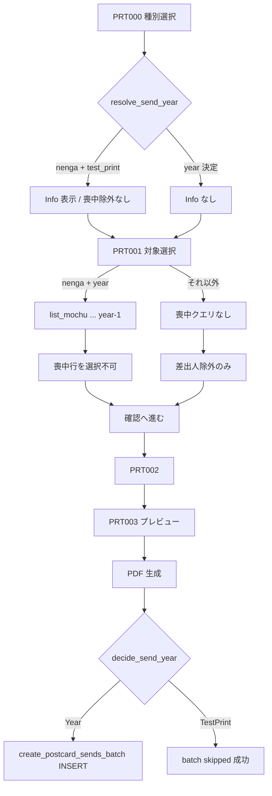

# 喪中はがきによる印刷対象外制御 — 設計書

- **Linear Issue**: [TOP-34](https://linear.app/topea-3/issue/TOP-34/喪中はがきによる印刷対象外制御機能を追加する) 喪中はがきによる印刷対象外制御機能を追加する
- **親 Issue**: [TOP-14](https://linear.app/topea-3/issue/TOP-14/v1-機能設計) v1 機能設計
- **ステータス**: Reviewed
- **最終更新**: 2026-09-19

---

## 1. 背景・目的

年賀状印刷の対象選択時に、前シーズンの喪中はがき受取がある相手を誤って選ばないようにする。あわせて、受取・送付の「年」を日付から都度導出せず明示カラムで扱い、印刷フローではがき種別を先頭で確定できるようにする。

本設計は TOP-34 の受け入れ条件を実装可能な契約に落とす。既存の宛名印刷設計（[postcard-address-print-v1-design.md](./postcard-address-print-v1-design.md)）の **FR-09（種別は PRT003 で確定）** および **「PDF 成功後は常に送付作成」** を本 Issue 範囲で上書きする。

---

## 2. スコープ

### 2.1 対象

| 領域 | 内容 |
|------|------|
| 受取 DB / 登録 | `postcard_receipts.receipt_year` 追加、登録時に `received_at` の西暦を保存。一覧・年一覧は `receipt_year` 基準 |
| 受取 UI | 新規作成の種別デフォルトを常に年賀状。住所録から選ぶ場合は複数チェック → 住所録 1 件につき受取 1 件 |
| 印刷フロー | 種別選択 → 対象選択 → 確認 → プレビュー → 印刷。プレビューの種別は固定表示 |
| 喪中除外 | 年賀状選択時、決定済み送付年 − 1 年に喪中受取がある宛名は「喪中」表示・選択不可 |
| テスト印刷表示 | 年賀状かつ送付年が決まらない期間は喪中除外しない。印刷フロー各画面上部にテスト印刷である旨の Info を表示 |
| 送付 DB / 作成 | `postcard_sends.send_year` 追加。印刷・手動とも送付年決定ルールを適用。一覧・年一覧は `send_year` 基準 |
| レイアウト保存 | 既存の永続化を維持。「レイアウトを保存する」文言。基準に戻す＝アプリデフォルト原点 |

### 2.2 非スコープ

- 喪中受取の自動通知・リマインダー
- 送付状況画面（`search_send_status`）の候補ロジック変更（`receiptYear` の意味は据え置き。年フィルタのカラム切替のみ本設計の影響を受ける）
- 差出人紐づけ除外ルールの変更（未紐づけ / archived は現行どおり）
- CSV 印刷・デザイン面印刷
- 既存データの「ルール遡及再計算」（backfill は日付暦年への一括移行のみ。11〜12 月印刷の過去 nenga を year+1 に直さない）

---

## 3. 要件

### 3.1 機能要件

| ID | 要件 |
|----|------|
| FR-01 | `postcard_receipts` に `receipt_year` を持ち、作成・更新時に `received_at` の西暦（例: 2026-01-01 → 2026）を保存する |
| FR-02 | 受取の年フィルタ・`list_postcard_receipt_years` は `receipt_year` を用いる |
| FR-03 | 受取新規作成の種別デフォルトは常に `nenga` |
| FR-04 | 「住所録から選ぶ」はチェックボックス複数選択。確定時に住所録 1 件 = 受取 1 件を作成する（共通の受取日・種別・メモ） |
| FR-05 | 印刷導線は **種別選択（新 PRT000）→ 対象選択（PRT001）→ 確認（PRT002）→ プレビュー（PRT003）→ 印刷** |
| FR-06 | PRT000 の種別デフォルトは `nenga`。確定した種別は `sessionStorage.printPostcardType` に保存し、以降の印刷画面で共有する |
| FR-07 | 種別が `nenga` かつ送付年が決定できるとき、`receipt_year = 送付年 - 1` かつ `category = mochu` の受取がある宛名は状態「喪中」・チェック不可 |
| FR-08 | 種別が `mochu`、または送付年が決定できない（テスト印刷期間の `nenga`）ときは、喪中除外を行わない（差出人除外は現行どおり） |
| FR-09 | テスト印刷期間の `nenga` では、印刷フロー中（PRT000〜PRT003）の画面上部に「テスト印刷のため送付履歴は作成されません」旨の Info を常時表示する |
| FR-10 | PRT003 の種別はセレクト不可の固定表示。レイアウトは「レイアウトを保存する」で永続化し、「基準に戻す」でアプリデフォルト原点に戻す（既存挙動） |
| FR-11 | `postcard_sends` に `send_year` を持ち、作成時に送付年決定ルールで保存する。年フィルタ・`list_postcard_send_years` は `send_year` を用いる |
| FR-12 | 印刷 batch: 送付年が決まる場合のみ `PostcardSend` を作成。テスト印刷期間の `nenga` は PDF 生成は行い、送付作成はスキップ（成功扱い） |
| FR-13 | 手動 batch: 同じ送付年決定ルールを適用。`nenga` で送付年が決まらない場合は Validation エラー（スキップしない） |

### 3.2 非機能要件

- オフライン完結（SQLite / Tauri）
- 送付年・受取年の算出は **ドメイン層**に集約し、UI とコマンドで二重実装しない
- 日付の「今」は既存どおり `chrono::Local`（印刷 batch の `sent_on` と同じ）
- 既存 active 行は migration で backfill し、NOT NULL 制約を付けられる状態にする

### 3.3 送付年の決定ルール（共通）

入力: はがき種別 `postcard_type`、基準日 `base_date`（印刷 batch = Local 今日、手動 = リクエストの `sent_on`）。

| 種別 | 条件 | 結果 |
|------|------|------|
| `mochu` | 常時 | `send_year = base_date.year` |
| `nenga` | 11/1〜12/31 | `send_year = base_date.year + 1` |
| `nenga` | 1/1〜1/31 | `send_year = base_date.year` |
| `nenga` | 上記以外（2/1〜10/31） | **送付年なし**（テスト印刷） |

例:

| base_date | 種別 | send_year |
|-----------|------|-----------|
| 2025-12-31 | nenga | 2026 |
| 2026-01-01 | nenga | 2026 |
| 2026-01-01 | mochu | 2026 |
| 2025-10-31 / 2026-02-01 | nenga | なし |

ドメイン API（案）:

```rust
enum SendYearDecision {
  Year(i32),
  TestPrint, // nenga かつシーズン外
}

fn decide_send_year(postcard_type: PostcardType, base_date: NaiveDate) -> SendYearDecision;
```

喪中除外用の参照年:

- `SendYearDecision::Year(y)` → 喪中判定の受取年 = `y - 1`
- `TestPrint` → 喪中除外なし + Info 表示

---

## 4. 現状分析

### 4.1 関連 docs

| ドキュメント | 関係 |
|-------------|------|
| [postcard-address-print-v1-design.md](./postcard-address-print-v1-design.md) | 印刷フロー・PRT001〜003・送付 batch。本設計が FR-09 / 常時送付作成を上書き |
| [postcard-receipt-v1-design.md](./postcard-receipt-v1-design.md) | 受取 CRUD。年は `received_at` 範囲だった → `receipt_year` へ |
| [postcard-send-v1-design.md](./postcard-send-v1-design.md) | 送付管理。年は `sent_on` 暦年だった → `send_year` へ |
| mock-up `postcard-print/*` / `postcard-receipt/create` | 画面差分の起点 |

### 4.2 関連実装（要約）

| 領域 | 現状 | ギャップ |
|------|------|----------|
| `postcard_receipts` | year カラムなし。年は `received_at` 導出 | `receipt_year` + 登録ロジック |
| `postcard_sends` | `sent_on` のみ。印刷は常に INSERT | `send_year` + 決定ルール + スキップ |
| 受取作成 UI | 種別デフォルトが月依存。住所録は単一選択 | 常時 nenga・複数選択・複数 create |
| 印刷ルート | `/print/select` 入口。種別は PRT003 セレクト | PRT000 追加・種別固定・喪中状態 |
| レイアウト prefs | `save_print_layout_preferences` 実装済（「調整を保存」） | 文言と種別変更 UI の削除 |

### 4.3 ギャップ対応方針

下位レイヤーから: migration → domain（年決定・エンティティ）→ repository 年カラム切替 → コマンド → フロント（受取 → 印刷フロー）。

---

## 5. 設計

### 5.1 データモデル / DB

#### 5.1.1 migration（案: `0008_add_receipt_year_and_send_year.sql`）

```sql
-- 受取年
ALTER TABLE postcard_receipts ADD COLUMN receipt_year INTEGER;
UPDATE postcard_receipts
  SET receipt_year = CAST(substr(received_at, 1, 4) AS INTEGER)
  WHERE receipt_year IS NULL;
-- 実装時: 全行埋まったことを確認したうえで NOT NULL 化（SQLite はテーブル再作成または CHECK 運用。本プロジェクト慣例に合わせる）

CREATE INDEX IF NOT EXISTS idx_postcard_receipts_active_receipt_year
  ON postcard_receipts (receipt_year DESC) WHERE deleted_at IS NULL;

CREATE INDEX IF NOT EXISTS idx_postcard_receipts_active_mochu_year_address
  ON postcard_receipts (receipt_year, address_entry_id)
  WHERE deleted_at IS NULL AND category = 'mochu' AND address_entry_id IS NOT NULL;

-- 送付年
ALTER TABLE postcard_sends ADD COLUMN send_year INTEGER;
UPDATE postcard_sends
  SET send_year = CAST(substr(sent_on, 1, 4) AS INTEGER)
  WHERE send_year IS NULL;

CREATE INDEX IF NOT EXISTS idx_postcard_sends_active_send_year
  ON postcard_sends (send_year DESC) WHERE deleted_at IS NULL;
```

- 過去データの `send_year` は `sent_on` 暦年の近似（ルール遡及なし）
- `receipt_year` / `send_year` はアプリが常に書き込む。SQL トリガーは置かない

#### 5.1.2 エンティティ

- `PostcardReceipt`: `receipt_year: i32` を追加。`create_new` / update で `received_at.year()` を設定
- `PostcardSend`: `send_year: i32` を追加。作成時のみ `decide_send_year` の `Year` から設定（`TestPrint` ではエンティティを作らない）

#### 5.1.3 クエリ切替

| 処理 | 変更後 |
|------|--------|
| `search_postcard_receipts` の year | `receipt_year = ?` |
| `list_received_years` | `DISTINCT receipt_year` |
| `search_postcard_sends` の year | `send_year = ?` |
| `list_sent_years` | `DISTINCT send_year` |
| `search_send_status` の対象年 | 送付側判定を `send_year` に切替。受取側 `receiptYear` フィルタは `receipt_year` に切替 |

### 5.2 API / Tauri コマンド

#### 5.2.1 受取

| コマンド | 変更 |
|----------|------|
| `create_postcard_receipt` | INSERT に `receipt_year`。応答 DTO にも含める |
| `create_postcard_receipts_batch`（新規） | 同一 `received_at` / `category` / `memo` で `address_entry_id[]`（1〜N、上限は既存 page 上限に合わせ 200）を受け、件数分作成。トランザクション。空配列・重複 ID は Validation |
| `update_postcard_receipt` | `received_at` 変更時に `receipt_year` 再計算 |
| `search` / `list_years` / `get` | 年カラム・フィルタ切替 |

単件 create は残す（匿名送り主など従来経路）。住所録複数選択 UI は batch を呼ぶ。

#### 5.2.2 送付年ヘルパ（Rust 公開はコマンド化しない）

`domain::print::send_year`（または `postcard_send` 隣接モジュール）に `decide_send_year` を置き、印刷・手動・（必要なら）フロント用の薄いコマンドから利用する。

フロントの Info / 喪中判定用に、基準日なし（= Local 今日）で結果だけ返すコマンドを追加してよい:

| コマンド | 概要 |
|----------|------|
| `resolve_send_year`（新規・任意） | 入力 `{ postcardType }` → `{ kind: "year", year } \| { kind: "test_print" }`。基準日はサーバ Local 今日 |

フロントだけで月日分岐を持たないこと（ずれ防止）。採用する場合は上記コマンドを必須とする。**本設計では `resolve_send_year` を採用する。**

#### 5.2.3 喪中宛名一覧

| コマンド | 概要 |
|----------|------|
| `list_mochu_receipt_address_entry_ids`（新規） | 入力 `{ receiptYear: number }` → `string[]`（active・`category=mochu`・`address_entry_id IS NOT NULL` の distinct） |

PRT001 は種別が nenga かつ `resolve_send_year` が year のとき、`receiptYear = year - 1` で本コマンドを呼び、該当 ID を状態「喪中」にする。

#### 5.2.4 印刷 batch

`create_postcard_sends_batch`:

1. `base_date = Local::today`
2. `decide_send_year(postcard_type, base_date)`
3. `TestPrint` → **INSERT せず** `{ skipped: true, reason: "test_print" }` 相当で成功（既存の冪等成功パスと区別できる応答）
4. `Year(y)` → 各行に `send_year = y` を付けて現行どおり INSERT（Conflict は冪等成功）

フロント: PDF 成功後に batch を呼ぶ現行順を維持。`skipped` 時は送付失敗 UI を出さない（トーストで「テスト印刷のため送付履歴は作成しませんでした」程度は可）。

#### 5.2.5 手動 batch

`create_postcard_sends_manual_batch`:

1. 各行（またはバッチ共通）の `sent_on` + `postcard_type` で `decide_send_year`
2. `TestPrint` → Validation（例: 「この時期の年賀状送付は登録できません。送付日を 1 月または 11〜12 月にしてください。」）
3. `Year(y)` → `send_year` 付きで INSERT。Conflict は現行どおり非冪等

同一バッチ内で `sent_on` が混在しうる場合は行ごとに判定。1 件でも TestPrint なら全体失敗（部分成功なし）。

#### 5.2.6 `resolve_print_job_items`

差出人除外ロジックは変更しない。喪中は PRT001 表示用の別コマンドとし、resolve 成功後の確認画面にも喪中 ID を混入させない（UI でチェック不可のため通常混入しない。万一 draft に残っていた場合は PRT001 入場時 prune と同様に除外する）。

### 5.3 フロントエンド

#### 5.3.1 受取作成（REC002）

| 項目 | 仕様 |
|------|------|
| 種別デフォルト | 常に `nenga`（月依存ロジック削除） |
| 住所録選択 | チェックボックス複数。確定で選択 ID をフォームに反映（表示は件数 or 代表名+他 N 件） |
| 保存 | 紐づけあり複数 → `create_postcard_receipts_batch`。紐づけ 0（匿名）→ 既存単件 create。紐づけ 1 件も batch でよい（実装単純化） |

#### 5.3.2 印刷画面

| 画面 ID | パス | 要点 |
|---------|------|------|
| PRT000（新規） | `/print/type` | 種別セレクト（デフォルト nenga）、「宛名選択画面へ」。ナビの印刷入口をここにする |
| PRT001 | `/print/select` | 喪中状態列。ボタン文言を「確認へ進む」に合わせる。テスト印刷 Info |
| PRT002 | `/print/confirm` | テスト印刷 Info。種別表示は読み取り専用で可 |
| PRT003 | `/print/preview` | 種別固定表示。セレクト削除。「レイアウトを保存する」。テスト印刷 Info。印刷時 batch の `skipped` 処理 |

`printJobDraft` に `postcardType` は引き続き含めない（`printPostcardType` キーを正とする）。PRT000 で確定後に PRT001 へ。

#### 5.3.3 テスト印刷 Info

- 表示条件: `resolve_send_year(nenga)` が `test_print`（種別が mochu のときは非表示）
- 文言（案）: 「現在はテスト印刷期間です。印刷はできますが、送付履歴は作成されません。」
- 配置: 各印刷画面のメインヘッダ直下（アラート/Info コンポーネント。既存デザインシステムに合わせる）

#### 5.3.4 喪中行（PRT001）

| 状態 | チェック | 表示 |
|------|----------|------|
| OK | 可 | 現行 |
| 除外（差出人） | 不可 | 現行 |
| 喪中 | 不可 | 「喪中」。差出人 OK でも喪中優先で選択不可 |

差出人除外と喪中が同時の場合は「除外」または併記どちらでもよいが、**選択不可**であること。推奨表示: 「喪中」（喪中の方がドメイン上の意味が強い）。差出人問題のみのとき従来どおり「除外」。

### 5.4 フロー



---

## 6. エッジケース・エラー処理

| ケース | 挙動 |
|--------|------|
| 喪中受取はあるが `address_entry_id` NULL（匿名） | 印刷対象外制御の対象外（住所録行に紐づかない） |
| 同一相手に同年度喪中が複数 | distinct で 1 回「喪中」 |
| 論理削除済み喪中受取 | 除外判定に使わない |
| draft に喪中 ID が残存 | PRT001 入場・進行時に選択解除 |
| 印刷中に日付が年跨ぎ | 各コマンド呼び出し時点の Local 日付で再評価（稀） |
| 手動 batch でシーズン外 nenga | Validation。DB 変更なし |
| 印刷テスト印刷で batch を直接叩く | サーバ側でも INSERT せず skipped |
| `receipt_year` と `received_at` 年の不一致 | update 時に再同期。手動 SQL 改ざんは対象外 |
| レイアウト未保存で離脱 | 既存の dirty ガードを維持 |

---

## 7. テスト方針

| 層 | 内容 |
|----|------|
| Domain | `decide_send_year` の境界日（10/31, 11/1, 12/31, 1/1, 1/31, 2/1）× nenga/mochu |
| Domain | `receipt_year` が `received_at` から付くこと |
| Repository | year フィルタが新カラムであること。mochu address id 一覧 |
| Command | 印刷 batch: シーズン内 INSERT / シーズン外 skipped。手動: シーズン外 Validation |
| Command | receipts batch: N 件作成・空/重複 Validation |
| Frontend（任意・軽量） | デフォルト種別、テスト印刷 Info 表示条件、喪中行 disabled |

---

## 8. 実装タスク（参考）

1. migration `0008` + backfill + index
2. `decide_send_year` + エンティティ / DTO 拡張
3. receipt / send repository の年カラム切替と mochu id 一覧
4. `create_postcard_receipts_batch` / `resolve_send_year` / `list_mochu_receipt_address_entry_ids`
5. `create_postcard_sends_batch` skipped / 手動 Validation
6. 受取作成 UI（デフォルト・複数選択）
7. PRT000・ルート入口・PRT001 喪中・Info・PRT003 固定種別・保存文言
8. 関連ユニットテスト
9. 既存設計書・モックへの参照追記（本ファイルを正とし、旧 FR-09 は「TOP-34 で上書き」と注記）

---

## 9. 未決事項

| 項目 | 状態 |
|------|------|
| テスト印刷時の喪中除外 | **決定**: 除外しない + フロー中 Info（ユーザー確認 1=A） |
| 年フィルタのカラム | **決定**: `receipt_year` / `send_year`（2=A） |
| 手動送付の送付年 | **決定**: 同一ルール。シーズン外は Validation（3=A） |
| Info / Validation の最終文言 | 実装時に UI トーンへ微調整可（意味は変えない） |
| SQLite での NOT NULL 化手順 | 既存 migration 慣例に合わせて実装時決定 |

---

## 10. 既存設計の上書き一覧

| 既存 | TOP-34 後 |
|------|-----------|
| 印刷 FR-09: 種別は PRT003 セレクト | 種別は PRT000 で確定。PRT003 は固定表示 |
| PDF 成功後は常に送付作成 | nenga テスト印刷期間は送付作成スキップ |
| 受取年 = `received_at` 範囲 | `receipt_year` カラム |
| 送付年 = `sent_on` 暦年 | `send_year` カラム + 決定ルール |
| 受取作成デフォルト種別（月依存） | 常に nenga |
| 住所録から選ぶ = 単一 | 複数チェック |
