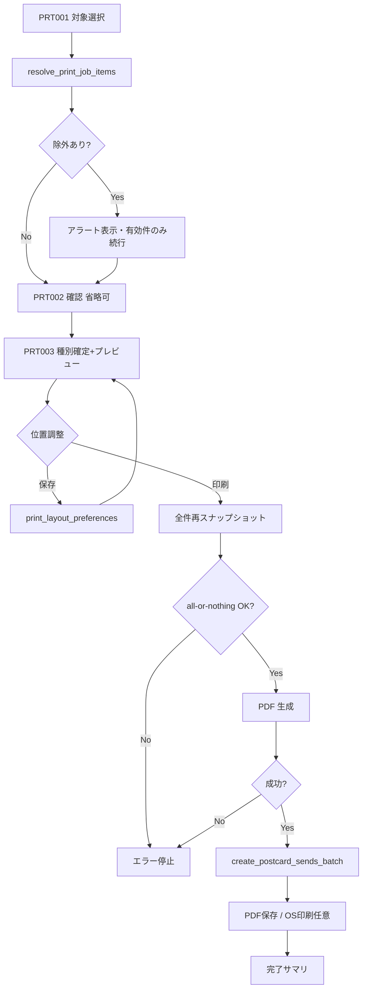

# はがき宛名面印刷（v1）— 設計書

- **Linear Issue**: [TOP-19](https://linear.app/topea-3/issue/TOP-19/v1-はがき宛名面印刷の機能設計) v1 はがき宛名面印刷の機能設計
- **親 Issue**: [TOP-14](https://linear.app/topea-3/issue/TOP-14/v1-機能設計) v1 機能設計
- **後続実装 Issue**: [TOP-28](https://linear.app/topea-3/issue/TOP-28/v1-はがき宛名面印刷機能の実装) v1 はがき宛名面印刷機能の実装
- **関連要求**: Linear Doc [要求仕様](https://linear.app/topea-3/document/要求仕様-0386f26238ae)
- **ステータス**: Draft
- **最終更新**: 2026-08-30

---

## 1. 背景・目的

v1.0.0 では年賀状・喪中はがき等の**宛名面印刷**を、住所録・差出人データと連携して行えるようにする。印刷前にレイアウトを確認・調整でき、**PDF 生成成功時**に**送付情報**を記録する。

本設計は TOP-19 のスコープに限定する。送付情報の一覧 CRUD 全機能・CSV 印刷・デザイン面印刷は別 Issue / 将来とする。

---

## 2. スコープ

### 2.1 対象（v1 / TOP-19）

| 領域 | 内容 |
|------|------|
| レイアウト | 官製はがき宛名面（100×148mm）。年賀状向け縦書き主体＋郵便番号横書き（[要求仕様](https://linear.app/topea-3/document/要求仕様-0386f26238ae)） |
| テンプレート | はがき種別（`nenga` / `mochu`）ごとのコード内テンプレート 1 式ずつ |
| 印刷モード | **1 件印刷** / **複数件一括印刷**（同一ジョブ内でページ分割、上限 200 件） |
| データ連携 | `AddressEntry` + `SenderAddressLink` 経由の差出人・印刷時 `PostcardSend` 作成 IF |
| プレビュー | HTML キャンバスで調整 UI。印字結果は PDF（ハイブリッド経路、§5.3.3） |
| 印刷実行 | PDF 生成 → 保存 / OS 既定アプリで印刷（任意） |
| 永続化 | レイアウト位置調整の保存（次回印刷へ反映）。表示 ON/OFF はセッションのみ |

### 2.2 非スコープ

- CSV 読み取り印刷（v1.1 の CSV 機能と整合。v1 は DB 経路のみ）
- デザイン面（イラスト・文面）印刷
- 差出人の手動差し替え・`SenderAddressLink` の更新（印刷フローでは行わない）
- 差出人電話番号の印字
- ユーザー定義テンプレートの CRUD（コード内テンプレートのみ。TOP-10 方針）
- 送付情報の一覧・編集 UI 全般（送付 Issue で設計。本設計は PDF 成功時の**作成 IF** のみ定義）
- はがき受取情報との自動連携
- PDF のパスワード保護（`requirements-and-constraints.md` §5 の検討事項。v1 では未対応）
- クラウド・複数端末同期

---

## 3. 要件

### 3.1 機能要件

| ID | 要件 |
|----|------|
| FR-01 | 住所録一覧から 1 件以上（最大 200 件）の `AddressEntry` を選択し、宛名面印刷フローを開始できる |
| FR-02 | 各宛名について、`SenderAddressLink` で紐づく有効な `SenderEntry` を差出人として使用する。紐づきが無い、または紐づく差出人が archived の宛名はアラートを出し**印刷対象から除外**する。手動での差出人差し替えは行わない |
| FR-03 | 宛名面レイアウトは要求仕様の項目（差出人エリア・宛名エリア）を印刷できる |
| FR-04 | 郵便番号は横書き、その他主要テキストは縦書き（年賀状一般的配置） |
| FR-05 | 連名は姓省略ルール（`PersonName::join_recipients`）に従う。宛名連名は最大 3 名、差出人連名は最大 4 名（超過時は Validation エラー）。同姓省略時は `coLast.{n}` レイヤーは出力しない |
| FR-06 | プレビュー画面（HTML キャンバス）でレイヤー単位の位置オフセットをグラフィカルに調整できる |
| FR-07 | 位置調整は永続化し、次回同種別印刷時にデフォルトとして適用する。オフセットは印刷可能範囲内にクランプし、「基準に戻す」操作を提供する |
| FR-08 | レイヤーごとの「印刷する / しない」はセッション内のみ有効（永続化しない） |
| FR-09 | はがき種別（`nenga` / `mochu`）は **PRT003 入場時**にヘッダセレクトで確定する。印刷直前の種別ダイアログは設けない |
| FR-10 | **PDF 生成成功**を「印刷完了」とし、1 印刷単位（1 宛名 × 紐づき差出人 × 1 種別）ごとに `PostcardSend` を作成する。OS 印刷ダイアログのキャンセルは検知しない |
| FR-11 | 一括印刷では、有効な選択順に 1 ページ 1 宛名の PDF を生成する（複数ページ 1 ジョブ） |
| FR-12 | アーカイブ済み `AddressEntry` / `SenderEntry` は印刷対象に選べない。印刷直前の再スナップショットでも archived / not found は Validation エラー |

### 3.2 非機能要件

- オフライン完結（`requirements-and-constraints.md`）
- **レンダリング（ハイブリッド）**:
  - 調整 UI / 画面プレビュー: HTML/CSS キャンバス
  - 印字結果: タスク 0 スパイク Pass → `@react-pdf/renderer` / Fail → html2canvas + jsPDF
  - 座標の正: 共通 `layoutSpec`（`usePrintJob` が HTML → PDF に同一適用）
  - 許容誤差: ±1mm。実寸 PDF を正とし、手動実寸比較を必須確認とする
- 用紙: 100mm × 148mm、余白 5mm、印刷可能範囲 94mm × 142mm
- 文字サイズ: 6pt 以上
- 日本語フォント: OS フォント名のみに依存せず、埋め込み TTF/OTF（例: Noto Serif JP）をバンドル。ライセンスは実装時に確認・記載
- 差出人・宛名は印刷時スナップショットを `PostcardSend` に保存
- 送付日: 端末ローカル日付 `sent_on`（`YYYY-MM-DD`）。受取履歴と同じ年度計算規約
- Tauri + SQLite + React の既存レイヤー構成に従う

### 3.3 はがき種別（受取履歴との整合）

| 値 | 表示名 | 印刷 | 受取 `PostcardReceiptCategory` |
|----|--------|------|----------------------------------|
| `nenga` | 年賀状 | ○ | `nenga`（同一値） |
| `mochu` | 喪中はがき | ○ | `mochu`（同一値） |
| `other` | その他 | ×（印刷対象外） | `other` |

将来の「受取履歴に基づく送付候補抽出」（`postcard-receipt-v1-design.md` §5.1.4）では `category` / `postcard_type` を共通キーとして参照できる。

---

## 4. 現状分析

### 4.1 関連 docs

| ドキュメント | 関連内容 |
|-------------|----------|
| `printing-layout-decision.md` | @react-pdf/renderer、コード内テンプレート、画面内プレビュー |
| `address-domain-v1.md` | AddressEntry、表示名・敬称・連名 |
| `sender-domain-v1.md` | SenderEntry、SenderAddressLink、印刷スナップショット方針 |
| `postcard-receipt-v1-design.md` | 受取は別機能。種別 enum・年度日付規約 |

### 4.2 関連実装

| 領域 | 状態 |
|------|------|
| 住所録 CRUD | 実装済（`list/get_address_entry` 等） |
| 差出人 CRUD・リンク | 実装済（`get_sender_id_by_address_entry_id` 等） |
| 受取履歴 | 実装済（`PostcardReceiptCategory`: `nenga` \| `mochu` \| `other`） |
| 印刷・PDF | **未実装** |
| 送付情報 | **未実装**（本設計で最小 IF を定義） |

### 4.3 ギャップ

| ギャップ | 対応方針 |
|---------|----------|
| 印刷モジュールなし | フロントに `features/print/` を新設 |
| 縦書き未検証 | **タスク 0 スパイク**をゲートに（§8） |
| 要求仕様のレイヤー調整永続化 | 基準座標（コード）＋ DB オフセット |
| PostcardSend 未設計 | 本設計で最小エンティティ・テーブルを定義 |
| OS 印刷キャンセル検知不可 | FR-10 で PDF 成功を完了条件に再定義 |

---

## 5. 設計

### 5.1 データモデル / DB

#### 5.1.1 印刷用 DTO（アプリ内）

```typescript
type PostcardType = 'nenga' | 'mochu';

type AddressPrintSnapshot = {
  addressEntryId: string;
  postalCode: string;       // formatted "123-4567"
  addressLine1: string;     // prefecture + city + street
  addressLine2: string;     // building（空可）
  primaryLast: string;
  primaryFirst: string;
  coRecipients: { last: string; first: string; omitLast: boolean }[]; // max 3
  honorificPrint: string;   // 印字用文字列。Honorific::None → ""
};

type SenderPrintSnapshot = {
  senderEntryId: string;
  postalCode: string;
  addressLine1: string;
  addressLine2: string;
  primaryLast: string;
  primaryFirst: string;
  coRecipients: { last: string; first: string; omitLast: boolean }[]; // max 4
};

type PrintJobItem = {
  address: AddressPrintSnapshot;
  sender: SenderPrintSnapshot;
  layerVisibility: Record<PrintLayerId, boolean>; // セッションのみ
  layoutOffsets: Record<PrintLayerId, { dx: number; dy: number }>; // pt
};

type PrintJob = {
  printJobId: string;       // UUID。idempotency / 二重投稿防止
  postcardType: PostcardType;
  items: PrintJobItem[];    // 有効な宛名のみ（紐づき差出人あり）
};
```

**敬称の組み立て（Rust / TS 共通）**: `Honorific::None`（表示「なし」）は `honorificPrint = ""`。`様` / `御中` / `ご家族様` はそのまま印字。

**同姓省略**: `omitLast: true` の連名は `recipient.coLast.{n}` / `sender.coLast.{n}` レイヤーを非表示・非出力とする。

#### 5.1.2 `print_layout_preferences`（永続化）

```sql
CREATE TABLE IF NOT EXISTS print_layout_preferences (
  id                  TEXT PRIMARY KEY,
  postcard_type       TEXT NOT NULL CHECK (postcard_type IN ('nenga', 'mochu')),
  layer_id            TEXT NOT NULL,
  offset_x_pt         REAL NOT NULL DEFAULT 0,
  offset_y_pt         REAL NOT NULL DEFAULT 0,
  updated_at          TEXT NOT NULL,
  UNIQUE (postcard_type, layer_id)
);
```

- 保存時・ドラッグ確定時にオフセットを**印刷可能範囲（94×142mm）内**へクランプ
- UI に「基準に戻す」（当該レイヤーまたは全体の offset を 0 にリセット）を提供

#### 5.1.3 `postcard_sends`（送付情報・最小 v1）

```sql
CREATE TABLE IF NOT EXISTS postcard_sends (
  id                  TEXT PRIMARY KEY,
  print_job_id        TEXT NOT NULL,           -- 同一 PDF ジョブの idempotency キー
  address_entry_id    TEXT NOT NULL,
  sender_entry_id     TEXT NOT NULL,
  sender_snapshot     TEXT NOT NULL,           -- JSON
  address_snapshot    TEXT NOT NULL,           -- JSON
  postcard_type       TEXT NOT NULL CHECK (postcard_type IN ('nenga', 'mochu')),
  sent_on             TEXT NOT NULL,           -- 端末ローカル 'YYYY-MM-DD'
  created_at          TEXT NOT NULL,           -- ISO 8601 datetime
  updated_at          TEXT NOT NULL,
  deleted_at          TEXT,
  FOREIGN KEY (address_entry_id) REFERENCES address_entries(id),
  FOREIGN KEY (sender_entry_id) REFERENCES sender_entries(id)
);

CREATE INDEX IF NOT EXISTS idx_postcard_sends_active_sent_on
  ON postcard_sends (sent_on DESC) WHERE deleted_at IS NULL;

CREATE INDEX IF NOT EXISTS idx_postcard_sends_active_address
  ON postcard_sends (address_entry_id, sent_on DESC) WHERE deleted_at IS NULL;

CREATE UNIQUE INDEX IF NOT EXISTS idx_postcard_sends_job_address
  ON postcard_sends (print_job_id, address_entry_id) WHERE deleted_at IS NULL;
```

- `sent_on`: 受取の `received_at` と同様、端末ローカル日付。年度フィルタの UTC 越年を回避
- `print_job_id` + `address_entry_id` の UNIQUE で同一ジョブの二重 INSERT を防止
- 誤記録は送付一覧の論理削除（`deleted_at`）で吸収（一覧 UI は別 Issue）

#### 5.1.4 紐づき差出人の解決

各 `address_entry_id` について:

1. `get_sender_id_by_address_entry_id` でリンク先を取得
2. リンク無し → **除外**（アラート一覧に追加）
3. リンク先 `SenderEntry` が archived → **除外**
4. 有効 → その差出人で `PrintJobItem` を構成

PRT002（差出人確認）は、除外後の一覧を表示する**読み取り専用確認**（省略可）。SEN005 の手動選択・リンク書き換えは**使用しない**。

### 5.2 API / Tauri コマンド

| コマンド | 用途 |
|----------|------|
| `resolve_print_job_items` | `address_entry_id[]` → 有効 `PrintJobItem[]` + 除外理由一覧 |
| `build_address_print_snapshot` | 1 件スナップショット（archived / not found は Validation エラー） |
| `build_sender_print_snapshot` | 1 件スナップショット（archived / not found は Validation エラー） |
| `list_print_layout_preferences` | `postcard_type` でオフセット一覧 |
| `save_print_layout_preferences` | オフセット一括保存（クランプ済み） |
| `create_postcard_sends_batch` | PDF 成功後、`print_job_id` 付きで N 件 INSERT（トランザクション） |

PDF 生成は**フロント**。Tauri はデータ解決・永続化・送付記録を担当。

### 5.3 フロントエンド

#### 5.3.1 画面・ルート

| 画面 ID | 名称 | パス（案） | 概要 |
|---------|------|-----------|------|
| PRT001 | 印刷対象選択 | `/print/select` | 住所録一覧から複数選択（最大 200） |
| PRT002 | 差出人確認 | `/print/confirm` | 紐づき差出人の読み取り専用確認（省略可） |
| PRT003 | プレビュー・調整 | `/print/preview` | 種別セレクト、HTML プレビュー、調整、PDF 生成 |

モック: [PRT001](../mock-up/postcard-print/postcard-print-select-view-mockup.md) / [PRT002](../mock-up/postcard-print/postcard-print-confirm-view-mockup.md) / [PRT003](../mock-up/postcard-print/postcard-print-preview-view-mockup.md)

**ジョブ状態**: 選択 ID 一覧と除外結果は React state + `sessionStorage`（キー: `printJobDraft`）。ブラウザリフレッシュ時は PRT001 へ戻す。

#### 5.3.2 レイヤー ID（要求仕様準拠）

```
recipient.postalCode
recipient.address1
recipient.address2
recipient.primaryLast
recipient.primaryFirst
recipient.honorific
recipient.coLast.{n}   // n = 1..3。omitLast 時は非表示
recipient.coFirst.{n}
recipient.coHonorific.{n}  // v1: 全体 honorificPrint を各連名に適用
sender.postalCode
sender.address1
sender.address2
sender.primaryLast
sender.primaryFirst
sender.coLast.{n}      // n = 1..4
sender.coFirst.{n}
```

基準座標 = `layout/<type>LayoutSpec.ts`。実座標 = 基準 + DB オフセット + セッション調整。

#### 5.3.3 モジュール構成（ハイブリッド）

```
src/features/print/
├── pages/
│   ├── PrintSelectPage.tsx
│   ├── PrintConfirmPage.tsx          # 省略可
│   └── PrintPreviewPage.tsx
├── components/
│   ├── PostcardPreviewCanvas.tsx    # HTML 調整 UI（正: layoutSpec）
│   └── PrintLayerPanel.tsx
├── render/
│   ├── reactPdf/                     # スパイク Pass 時
│   │   ├── AddressPageDocument.tsx
│   │   └── renderPrintPdf.ts
│   └── htmlCapture/                  # スパイク Fail 時
│       └── renderPrintPdf.ts
├── layout/
│   ├── nengaLayoutSpec.ts
│   └── mochuLayoutSpec.ts
├── hooks/
│   └── usePrintJob.ts               # spec → HTML / PDF 座標変換
└── types.ts
```

#### 5.3.4 差出人・宛名の印字ルール

| 項目 | ルール |
|------|--------|
| 宛名氏名 | `primaryLast` + `primaryFirst` + `honorificPrint`（縦書き） |
| 宛名連名 | `omitLast` なら `coLast.{n}` 非出力。`coFirst.{n}` のみ |
| 差出人氏名 | 姓 + 名（敬称・電話なし） |
| 住所分割 | `addressLine1` = 都道府県+市区町村+町名番地、`addressLine2` = 建物 |
| 郵便番号 | 横書き |

Validation: 宛名連名 ≤ 3、差出人連名 ≤ 4（`SenderEntry::MAX_CO_RECIPIENTS`）。

### 5.4 フロー



**一括印刷**: all-or-nothing。1 件でも archived / not found なら PDF も送付 INSERT も行わない。

**送付記録タイミング**: PDF 生成成功直後。OS 印刷の成否・キャンセルは問わない。

---

## 6. エッジケース・エラー処理

| ケース | 動作 |
|--------|------|
| 印刷対象 0 件 | 「1 件以上選択してください」 |
| 200 件超 | 「最大 200 件まで選択できます」 |
| 全件紐づき差出人なし | アラートのみ。プレビューへ進めない |
| 一部のみ紐づきなし | 除外宛名をアラート表示。残りで続行 |
| 連名上限超過 | Validation エラー。プレビュー入場前にブロック |
| 印刷直前に archived | all-or-nothing で停止、エラー一覧 |
| PDF 生成失敗 | エラー表示。送付記録は行わない |
| OS 印刷キャンセル | 送付記録は**変更しない**（既に PDF 成功時に記録済み） |
| 送付 INSERT 失敗 | 「PDF は生成済み。送付記録に失敗しました。再試行してください」 |
| 同一 print_job_id 再実行 | UNIQUE 制約で二重 INSERT 防止 |
| レイアウト prefs 未保存離脱 | 確認ダイアログ |
| 種別切替（未保存 offset） | 確認ダイアログ |

---

## 7. テスト方針

| 層 | 内容 |
|----|------|
| domain | スナップショット組み立て、`honorificPrint`（なし→空）、`omitLast`、連名上限 |
| infrastructure | layout prefs CRUD、`postcard_sends` INSERT、UNIQUE `print_job_id` |
| command_tests | `resolve_print_job_items` 除外理由、両 snapshot の archived エラー、batch send |
| frontend | Vitest: layoutSpec 座標、クランプ、visibility マージ |
| 手動（必須） | 敬称「なし」「御中」「ご家族様」印字、同姓省略 coLast 非表示、HTML vs PDF ±1mm 実寸比較 |
| 手動 | 一括 3 件、途中 archived の all-or-nothing、prefs 未保存離脱、種別切替 |

---

## 8. 実装タスク（参考）

| # | タスク | 依存 |
|---|--------|------|
| **0** | **スパイク: 縦書き+日本語フォント+はがき 1 枚 PDF**。Pass → react-pdf / Fail → html2canvas | — |
| 1 | `@react-pdf/renderer` または html2capture 導入（タスク 0 結果） | 0 |
| 2 | `nengaLayoutSpec` + 印字パイプライン 1 ページ | 1 |
| 3 | migration: `print_layout_preferences`, `postcard_sends` | — |
| 4 | Tauri: `resolve_print_job_items` + snapshot + prefs + batch send | 3 |
| 5 | PRT001 + ジョブ state（sessionStorage） | — |
| 6 | PRT002 確認（省略可） | 4 |
| 7 | PRT003 HTML プレビュー + レイヤー調整 | 2, 4 |
| 8 | PDF 生成 + 送付記録連携 | 7 |
| 9 | `mochu` テンプレート差分 | 2 |
| 10 | 一括印刷（多ページ PDF + all-or-nothing） | 8 |

**タスク 0 成否基準**: 官製はがき実寸で氏名+住所+敬称が縦書きで読める PDF が 1 枚。郵便番号のみ横書き。

**タスク 0 Fail 退避**: html2canvas + jsPDF を主経路。横書きオプションの v1 必須化は行わない（要求仕様の縦書きを維持）。

---

## 9. 未決事項

| 項目 | 内容 | 扱い |
|------|------|------|
| CSV 印刷経路 | v1.1 CSV と合わせて設計 | 非スコープ |
| OS 印刷の具体 API | PDF 保存後シェル open 等 | TOP-28 で Windows 優先 |
| PostcardSend 一覧 UI | CRUD・受取連携 | 送付 Issue |
| PDF パスワード保護 | requirements §5 | v1 非対応・§2.2 に明記 |
| 連名敬称個別レイヤー | 要求仕様の coHonorific n | v1 は全体 honorific を適用 |
| PRT002 省略可否 | UX 次第 | 実装時に判断可 |

---

## 10. 自己レビュー記録（設計時）

```
- [x] Issue 要件の充足（ブロッカー）
- [x] 機能矛盾なし（ブロッカー）— FR-02/§5.3.1/一括方針を紐づき差出人に統一
- [x] 実装済み機能との整合（ブロッカー）— nenga/mochu、Honorific、MAX_CO_RECIPIENTS
- [x] 方針・要件・アーキテクチャとの整合（ブロッカー）
- [x] 改善点は対応済み、または未決事項に移した
```
