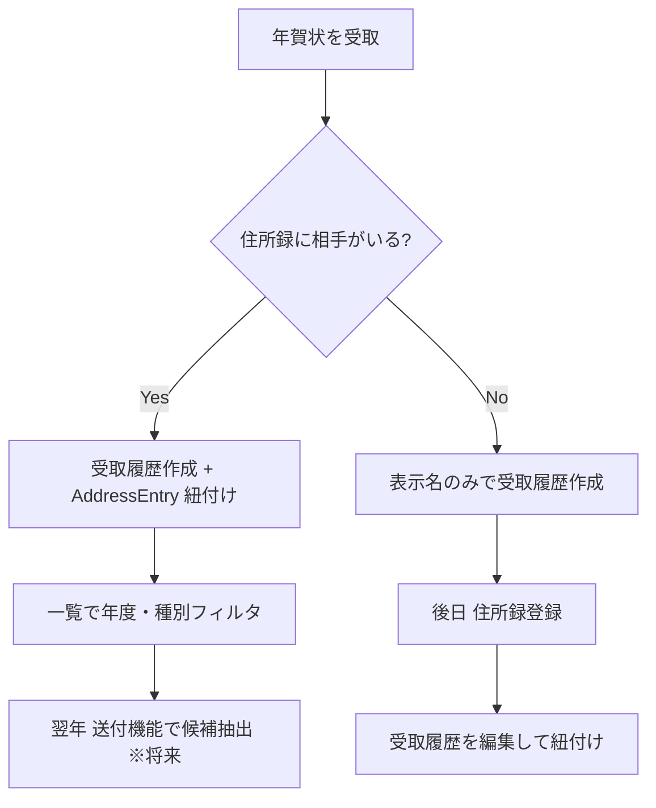

# はがき受取情報管理（v1）— 設計書

- **Linear Issue**: [TOP-17](https://linear.app/topea-3/issue/TOP-17/v1-はがき受取情報管理の機能設計) v1 はがき受取情報管理の機能設計
- **親 Issue**: [TOP-14](https://linear.app/topea-3/issue/TOP-14/v1-機能設計) v1 機能設計
- **後続実装 Issue**: [TOP-26](https://linear.app/topea-3/issue/TOP-26/v1-はがき受取情報管理機能の実装)
- **ステータス**: Reviewed
- **最終更新**: 2026-05-31

---

## 1. 背景・目的

v1.0.0 では年賀状などのやり取りを記録し、翌年の送付判断（「昨年もらった相手に送る」）に活用するため、**はがきの受取履歴**を管理する機能を提供する。

本設計は TOP-17 のスコープである「受取情報管理」に限定する。送付情報管理・宛名面印刷は別 Issue で設計・実装する。

---

## 2. スコープ

### 2.1 対象（v1 / TOP-17）

- 受取履歴エンティティ `PostcardReceipt` のドメイン・DB 設計
- 住所録 `AddressEntry` との紐付け（任意・1:N）
- 受取履歴の CRUD（作成・一覧・詳細・編集・論理削除）
- 一覧のフィルタ（年度・種別・相手）と検索
- 送付情報管理（将来）向けの参照インターフェース定義

### 2.2 非スコープ

- はがき**送付**情報の CRUD（別機能設計）
- 宛名面印刷
- CSV 入出力・バックアップ/リストア（v1.1 以降）
- 受取履歴の「削除済み一覧」画面（一覧から非表示のみ。復元 UI も v1 非スコープ）
- 複数ユーザー・端末間同期

---

## 3. 要件

### 3.1 機能要件

| ID | 要件 |
|----|------|
| FR-01 | ユーザーは 1 件の受取履歴に「受取日」「種別」「メモ」を登録できる |
| FR-02 | 受取履歴は任意で住所録エントリ 1 件に紐づけられる（1 住所録 : N 受取履歴） |
| FR-03 | 住所録未紐付け（匿名受取）の履歴も登録できる。一覧では表示用ラベルで識別する |
| FR-04 | 紐付け済み履歴は、一覧・詳細で住所録の表示名・住所を参照して表示する |
| FR-05 | 紐付け先住所録がアーカイブ済みでも、履歴自体は表示可能（参照はスナップショットまたは ID 解決失敗時のフォールバック） |
| FR-06 | 一覧で年度・種別・相手（紐付け先）でフィルタできる |
| FR-07 | 一覧でフリーテキスト検索（表示名・メモ）ができる |
| FR-08 | 詳細表示・編集・論理削除ができる |
| FR-09 | デフォルトソートは受取日降順 |

### 3.2 非機能要件

- オフライン完結（`requirements-and-constraints.md`）
- 個人利用規模（数千件程度）で一覧・検索が実用的な応答時間
- 受取履歴は **`deleted_at IS NULL` を active 条件**とする（住所録・差出人の `archived_at` とは別方針）
- Tauri コマンド + SQLite（sqlx）+ React の既存レイヤー構成に従う

---

## 4. 現状分析

### 4.1 関連 docs

| ドキュメント | 関連内容 |
|-------------|----------|
| `docs/overview/decisions-summary.md` | History エンティティのラフ定義（送受信種別） |
| `docs/tech-decisions/data-persistence-decision.md` | 履歴は Address への FK、リレーショナル構造 |
| `docs/domain/address-domain-v1.md` | AddressEntry、archive 方針、将来 PostcardHistory 参照 |
| `docs/domain/sender-domain-v1.md` | 差出人は受取とは独立（v1 受取では sender 紐付け不要） |
| `docs/mock-up/address-entry/*` | 一覧・詳細・編集 UI の画面 ID・操作パターン |

### 4.2 関連実装

- 住所録: `src/features/address/`, `src-tauri/src/domain/address/`, migrations `0001_*`
- 差出人: `src/features/sender/`, migrations `0002_*`, `0004_*`
- **受取履歴**: 未実装

### 4.3 ギャップ

- 受取履歴用のドメイン・テーブル・Tauri コマンド・画面が存在しない
- `data-persistence-decision.md` の History は送受信一体のラフ名称。v1 では受取・送付を機能分割するため、**受取専用エンティティ**として具体化する

---

## 5. 設計

### 5.1 ドメイン

#### 5.1.1 エンティティ: `PostcardReceipt`

**役割**: はがきを 1 通受け取った事実を 1 件表す。

| 属性 | 型 | 必須 | 説明 |
|------|-----|------|------|
| `id` | UUID | ○ | 主キー |
| `addressEntryId` | UUID \| null | — | 紐付け先住所録。null = 未紐付け（匿名受取） |
| `senderDisplayName` | string | △ | 未紐付け時の一覧表示用（例: 「田中家」）。紐付け時は空でも可（住所録表示名を使用） |
| `receivedAt` | date | ○ | 受取日（暦日。タイムゾーンは端末ローカル日付） |
| `category` | PostcardReceiptCategory | ○ | 種別（後述） |
| `memo` | string \| null | — | 自由記述メモ |
| `deletedAt` | datetime \| null | — | null = 有効。設定時は論理削除 |
| `createdAt` / `updatedAt` | datetime | ○ | 監査用 |

**ドメインルール**

- `receivedAt` は未来日不可（Validation）
- `addressEntryId` が null のとき `senderDisplayName` は必須（1 文字以上）
- `addressEntryId` が設定されているとき、参照先は **active な AddressEntry** のみ許可（create/update 時 Validation）
- 削除は `deletedAt` 設定による論理削除。物理削除しない。v1 では復元 UI なし

#### 5.1.2 値オブジェクト: `PostcardReceiptCategory`

v1 プリセット（文字列 enum）:

| 値 | 表示名 |
|----|--------|
| `nenga` | 年賀状 |
| `mochu` | 喪中はがき |
| `other` | その他 |

#### 5.1.3 住所録との関係

```
AddressEntry 1 ──< N PostcardReceipt
```

- **1:N** を採用（同一相手から複数年度・複数種別の受取を記録）
- **1:1 は不採用**（履歴として複数件必要）
- **匿名受取**: `addressEntryId = null` + `senderDisplayName` で一覧識別。後から編集で住所録に紐付け可能

**採用理由**: 年賀状運用では同一相手から毎年受取するため 1:N が自然。未登録の相手から届いた場合も記録できるよう匿名を許容する。

#### 5.1.4 送付情報管理との連携インターフェース（将来）

受取側が提供する参照情報（送付機能設計時に利用）:

| 用途 | 参照方法 |
|------|----------|
| 昨年（または指定年度）に受取した相手一覧 | `postcard_receipts` を `received_at` の年でフィルタし、`address_entry_id` で distinct |
| 相手ごとの最新受取日 | `address_entry_id` ごとに `MAX(received_at)` |
| 匿名受取の除外 | `address_entry_id IS NOT NULL` 条件 |

送付側 `PostcardSend`（仮称）は将来 `address_entry_id` を共有キーとし、**「受取履歴に基づく送付候補抽出」は repository 層のクエリ**として実装する（v1 受取スコープでは API のみ予約し、実装は送付 Issue へ）。

### 5.2 データモデル / DB

#### 5.2.1 テーブル: `postcard_receipts`

```sql
CREATE TABLE IF NOT EXISTS postcard_receipts (
  id                  TEXT PRIMARY KEY,
  address_entry_id    TEXT,                -- FK → address_entries(id), NULL 可
  sender_display_name TEXT,                -- 未紐付け時必須（アプリ Validation）
  received_at         TEXT NOT NULL,       -- ISO 8601 日付 'YYYY-MM-DD'
  category            TEXT NOT NULL,       -- PostcardReceiptCategory
  memo                TEXT,
  deleted_at          TEXT,
  created_at          TEXT NOT NULL,
  updated_at          TEXT NOT NULL,
  FOREIGN KEY (address_entry_id) REFERENCES address_entries(id)
);

CREATE INDEX IF NOT EXISTS idx_postcard_receipts_active_received_at
  ON postcard_receipts (received_at DESC) WHERE deleted_at IS NULL;

CREATE INDEX IF NOT EXISTS idx_postcard_receipts_active_address
  ON postcard_receipts (address_entry_id, received_at DESC) WHERE deleted_at IS NULL;
```

- マイグレーション: `0005_create_postcard_receipt_tables.sql`（実装時に採番）
- `address_entry_id` に FK 制約。削除は論理削除のため ON DELETE は未定義（SQLite デフォルト）

#### 5.2.2 一覧・検索クエリ方針

| 条件 | SQL 概要 |
|------|----------|
| active のみ | `deleted_at IS NULL` |
| 年度 | `received_at` が `YYYY-01-01` 〜 `YYYY-12-31` |
| 種別 | `category = ?` |
| 相手 | `address_entry_id = ?` |
| 検索 | `sender_display_name` / `memo` LIKE、または JOIN 先 Address の氏名・住所（search API で OR 結合） |
| ソート | `received_at DESC, id ASC` |
| ページング | `LIMIT` / `OFFSET`（既存 `MAX_PAGE_LIMIT = 200` 準拠） |

### 5.3 API / Tauri コマンド

命名・エラー処理は住所録・差出人に準拠（`*_impl` + Validation 文言 / Repository 固定コード）。

| コマンド | 概要 |
|----------|------|
| `create_postcard_receipt` | 新規作成 |
| `update_postcard_receipt` | 更新 |
| `get_postcard_receipt` | 詳細 1 件 |
| `search_postcard_receipts` | 一覧・フィルタ・検索（`items` + `total`） |
| `delete_postcard_receipt` | 論理削除（`deleted_at` 設定） |

#### `search_postcard_receipts` 入力（案）

```typescript
{
  keyword?: string | null,       // 表示名・メモ
  year?: number | null,          // 受取年（例: 2025）
  category?: string | null,      // PostcardReceiptCategory
  addressEntryId?: string | null,
  includeDeleted?: boolean,      // デフォルト false
  limit: number,
  offset: number,
  sortOrder: 'desc' | 'asc'      // received_at。v1 は desc のみでも可
}
```

#### Validation エラー例

| 条件 | メッセージ（案） |
|------|------------------|
| 未紐付けかつ表示名空 | 「送り主の表示名を入力してください。」 |
| 紐付け先 not found | `address entry not found` |
| 紐付け先 archived | `address entry is archived` |
| 未来の受取日 | 「受取日に未来の日付は指定できません。」 |
| 不正な種別 | 種別の Validation エラー |

### 5.4 フロントエンド

#### 5.4.1 画面一覧

| 画面 ID | 名称 | パス（案） | モック |
|---------|------|-----------|--------|
| REC001 | 受取履歴一覧 | `/receipts` | `docs/mock-up/postcard-receipt/postcard-receipt-list-view-mockup.md` |
| REC002 | 受取履歴作成 | `/receipts/new` | 同ディレクトリ create |
| REC003 | 受取履歴編集 | `/receipts/:id/edit` | 同ディレクトリ edit |
| REC004 | 受取履歴詳細 | `/receipts/:id` | 同ディレクトリ detail |

ナビゲーション: アプリ共通ヘッダーに「受取履歴」リンクを追加（住所録・差出人と並列）。

#### 5.4.2 一覧（REC001）要点

- フィルタ: 受取年（セレクト、年 / 全期間）、種別、相手（住所録選択ダイアログ）
- 検索: 「表示名・メモで検索」
- カラム: 受取日 / 種別 / 送り主（紐付け時は住所録表示名、未紐付け時は `senderDisplayName`）/ メモ抜粋 / 操作
- ページング: 既存 `PaginationControls` パターン
- 行クリック → 詳細（REC004）

#### 5.4.3 作成・編集フォーム要点

| 項目 | UI |
|------|-----|
| 受取日 | date input |
| 種別 | select |
| 送り主 | ラジオ: 「住所録から選ぶ」/「表示名のみ」 |
| 住所録 | AddressEntry 選択ダイアログ（active のみ） |
| 表示名 | 未紐付け時表示・必須 |
| メモ | textarea |

#### 5.4.4 詳細（REC004）

- 全項目表示
- 紐付け住所録がある場合はリンク（住所録詳細へ遷移）
- 編集・削除ボタン

### 5.5 主要ユースケース



---

## 6. エッジケース・エラー処理

| ケース | 方針 |
|--------|------|
| 紐付け住所録をアーカイブ | 履歴は残る。一覧 JOIN 失敗時は `senderDisplayName` または「（削除済みの宛名）」表示 |
| 紐付け住所録を後から変更 | update で `addressEntryId` 差し替え可 |
| 同一日・同一相手の重複 | v1 では禁止しない（複数通受取の可能性） |
| 年度フィルタとタイムゾーン | `received_at` は日付文字列のみ保持し TZ 問題を回避 |
| 空の一覧 | 空状態 UI + 新規作成導線 |

---

## 7. テスト方針

| 層 | 内容 |
|----|------|
| domain | `PostcardReceiptCategory`、受取日未来日 NG、未紐付け時表示名必須 |
| repository | CRUD、年度/種別/相手フィルタ、search、`deleted_at IS NULL` 条件 |
| command | Validation エラー文言、紐付け先 archived/not found |
| 結合 | `setup_pool` + migration 0005 適用後の command_tests |

---

## 8. 実装タスク（TOP-26 向け）

- [ ] migration `postcard_receipts` テーブル
- [ ] domain: `PostcardReceipt`, `PostcardReceiptCategory`, repository trait
- [ ] infrastructure: sqlx repository + tests
- [ ] Tauri commands + `command_tests`
- [ ] frontend: types, hooks, REC001–004 画面
- [ ] AddressEntry 選択ダイアログの再利用または薄いラッパ
- [ ] ルーティング・ナビゲーション追加
- [x] mock-up 4 画面（`docs/mock-up/postcard-receipt/` — 設計フェーズで作成済み）

---

## 9. 未決事項

| 項目 | 状態 | 備考 |
|------|------|------|
| 種別プリセットの追加・編集 | v1 固定 | ユーザー定義種別は v1.1 以降 |
| 受取履歴からの住所録新規作成 | v1 非スコープ | 編集画面から住所録詳細へ誘導のみ |
| 送付側 API の具体コマンド名 | 送付設計 Issue で決定 | 本設計 §5.1.4 のクエリ要件を引き渡し |

---

## 変更履歴

| 日付 | 内容 |
|------|------|
| 2026-05-30 | 初版（TOP-17 設計） |
| 2026-05-31 | 論理削除（`deleted_at`）へ変更、種別を 3 種に整理 |
