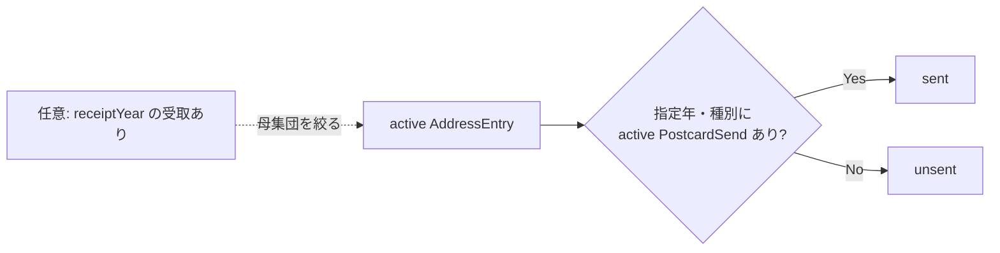
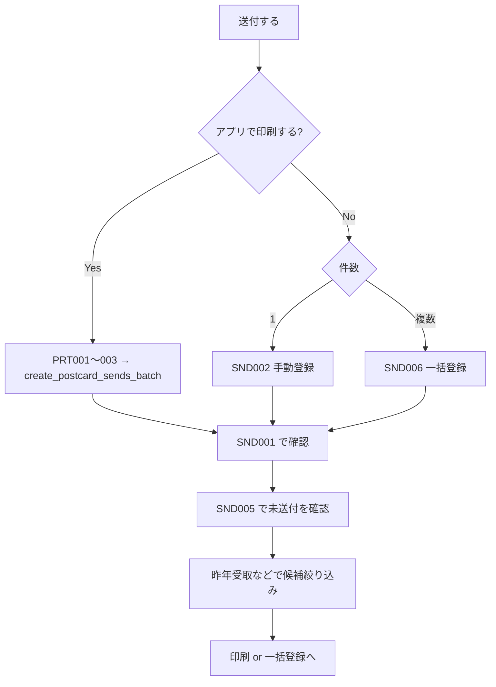

# はがき送付情報管理（v1）— 設計書

- **Linear Issue**: [TOP-18](https://linear.app/topea-3/issue/TOP-18/v1-はがき送付情報管理の機能設計) v1 はがき送付情報管理の機能設計
- **親 Issue**: [TOP-14](https://linear.app/topea-3/issue/TOP-14/v1-機能設計) v1 機能設計
- **後続実装 Issue**: [TOP-27](https://linear.app/topea-3/issue/TOP-27/v1-はがき送付情報管理機能の実装)
- **関連設計**: [postcard-address-print-v1-design.md](./postcard-address-print-v1-design.md)（`PostcardSend` 最小定義・印刷時作成）、[postcard-receipt-v1-design.md](./postcard-receipt-v1-design.md)（受取連携 IF）
- **ステータス**: Reviewed
- **最終更新**: 2026-09-10

---

## 1. 背景・目的

v1.0.0 では、年賀状等の**送付事実**を記録し、「今年送った / 送っていない」を把握できるようにする。印刷（TOP-19 / TOP-28）は PDF 成功時に `PostcardSend` を作成する経路を既に持つ。本設計は **一覧・検索・手動登録・編集・論理削除・送付状況判定・一括登録方針** を実装可能な粒度まで定義する。

---

## 2. スコープ

### 2.1 対象（v1 / TOP-18）

- 送付履歴エンティティ `PostcardSend` のドメイン拡張（印刷最小定義の上に CRUD・照会を載せる）
- 住所録・差出人・受取履歴との関係整理
- 送付履歴一覧（年度・種別・検索）と詳細・編集・論理削除
- 「指定年・種別に送った / 送っていない」判定ロジックと送付状況ビュー
- 単件登録・一括登録のインターフェース方針（印刷経路との役割分担含む）

### 2.2 非スコープ

- 宛名面印刷フロー本体（PRT001–003。送付記録の**作成側**は印刷設計済み）
- 暑中・寒中など `nenga` / `mochu` 以外の種別プリセット（v1.1 以降。Issue 文言の「ほか」は将来拡張）
- CSV 入出力・バックアップ/リストア（v1.1 以降）
- 削除済み一覧・復元 UI
- 複数ユーザー・端末間同期
- ユーザー定義テンプレート CRUD（コード内テンプレート方針のまま。`postcard_type` がテンプレート識別子）

---

## 3. 要件

### 3.1 機能要件

| ID | 要件 |
|----|------|
| FR-01 | ユーザーは送付履歴 1 件を「宛先（住所録）」「差出人」「送付日」「種別」「スナップショット」として参照できる |
| FR-02 | 印刷フロー（既存 `create_postcard_sends_batch`）で作成された履歴を一覧・詳細で確認できる |
| FR-03 | アプリ外で送付した場合など、印刷を経ずに手動で送付履歴を登録できる（単件） |
| FR-04 | 複数宛先を選び、同一種別・送付日で一括登録できる（上限 200。印刷と同じ） |
| FR-05 | 一覧で年度・種別でフィルタし、フリーテキスト検索（宛名・差出人ラベル相当）ができる |
| FR-06 | 指定年・種別について「送った住所録」「送っていない住所録」を一覧できる |
| FR-07 | 受取履歴（**対象年と独立した受取年**）に紐づく住所録を送付候補として参照できる。受取限定チェックの**初期値は ON**、受取年デフォルトは昨年 |
| FR-08 | 詳細表示・送付日/種別/メモの編集・論理削除ができる。宛先・差出人の差し替えは v1 非対応（削除＋再登録） |
| FR-09 | デフォルトソートは送付日降順（履歴タブ）。送付状況タブは **`name_kana` 昇順**（住所録 / PRT001 と同じ）+ `address_entry_id ASC` |
| FR-10 | 使用テンプレートは v1 では `postcard_type`（`nenga` / `mochu`）と同一視する |

### 3.2 非機能要件

- オフライン完結（`requirements-and-constraints.md`）
- 個人利用規模（数千件）で一覧・送付状況照会が実用的な応答時間
- 送付履歴は **`deleted_at IS NULL` を active 条件**（受取履歴と同方針。住所録の `archived_at` とは別）
- 年度は `sent_on`（`YYYY-MM-DD`）の暦年。端末ローカル日付規約は印刷・受取と同一
- Tauri コマンド + SQLite（sqlx）+ React の既存レイヤー構成に従う
- 既存 `postcard_sends` テーブル・印刷用 `create_postcard_sends_batch` と破壊的に矛盾しない

---

## 4. 現状分析

### 4.1 関連 docs

| ドキュメント | 関連内容 |
|-------------|----------|
| `docs/overview/decisions-summary.md` | History ラフ（送受信一体）→ v1 では受取/送付に分割 |
| `docs/design/postcard-address-print-v1-design.md` | `postcard_sends` 最小スキーマ、スナップショット、batch 作成、idempotency |
| `docs/design/postcard-receipt-v1-design.md` | 受取 CRUD、§5.1.4 送付候補抽出 IF |
| `docs/domain/address-domain-v1.md` | AddressEntry、archive |
| `docs/domain/sender-domain-v1.md` | SenderEntry、SenderAddressLink |

### 4.2 関連実装

| 領域 | 状態 |
|------|------|
| `postcard_sends` テーブル（migration 0006） | 実装済 |
| `PostcardSend` domain / `create_batch` / `create_postcard_sends_batch` | 実装済（印刷専用） |
| 印刷 UI からの送付記録 | 実装済 |
| 送付 CRUD・一覧・送付状況 API / UI | **未実装** |
| 受取履歴 CRUD | 実装済 |

### 4.3 ギャップ

| ギャップ | 対応方針 |
|---------|----------|
| 印刷は INSERT のみ。search / get / update / delete なし | repository・コマンドを拡張 |
| 手動・一括登録経路なし | `create_postcard_sends_manual_batch` を追加（印刷 batch とは入力・検証が異なる） |
| メモ・登録経路（印刷/手動）の区別なし | migration で `memo` / `source` を追加 |
| 「未送付」は住所録 × 送付の差集合 | `search_send_status` 系コマンドを新設 |
| Issue の暑中/寒中 | v1 非スコープ（既存 CHECK `nenga`/`mochu` を維持） |

---

## 5. 設計

### 5.1 ドメイン

#### 5.1.1 エンティティ: `PostcardSend`（拡張）

**役割**: はがきを 1 通送付した事実を 1 件表す。印刷完了時および手動登録の両方で同一エンティティを用いる。

| 属性 | 型 | 必須 | 説明 |
|------|-----|------|------|
| `id` | UUID | ○ | 主キー |
| `printJobId` | UUID | ○ | 同一バッチの冪等キー。印刷ジョブ ID、または手動一括のバッチ UUID |
| `addressEntryId` | UUID | ○ | 宛先住所録（必須。匿名送付は v1 非対応） |
| `senderEntryId` | UUID | ○ | 差出人 |
| `senderSnapshot` | JSON string | ○ | 登録時点の差出人印字スナップショット |
| `addressSnapshot` | JSON string | ○ | 登録時点の宛名印字スナップショット |
| `postcardType` | `PostcardType` | ○ | `nenga` \| `mochu`（＝使用テンプレート識別） |
| `sentOn` | date | ○ | 送付日（暦日） |
| `source` | `PostcardSendSource` | ○ | `print` \| `manual` |
| `memo` | string \| null | — | 自由記述。**最大 1000 コードポイント**（受取 `memo` と同上限。アプリ Validation のみ） |
| `deletedAt` | datetime \| null | — | null = 有効 |
| `createdAt` / `updatedAt` | datetime | ○ | 監査用 |

**ドメインルール**

- `sentOn` は未来日不可（手動作成・更新時 Validation）。印刷経路は従来どおりコマンド内 `Local::today` のため未来にならない
- create/update 時、`addressEntryId` / `senderEntryId` は **active**（`archived_at IS NULL`）のみ許可
- 削除は `deletedAt` 論理削除。v1 に復元 UI なし
- 更新で変更可能なのは `sentOn` / `postcardType` / `memo` のみ。スナップショット・宛先・差出人・`printJobId`・`source` は不変
- 同一 `(printJobId, addressEntryId)` の active 行は UNIQUE（既存）。意図した再送付は別バッチ UUID で別レコード
- `memo` が非 null のとき、Unicode コードポイント数が 1000 を超えてはならない

#### 5.1.2 値オブジェクト

**`PostcardType`**（既存・印刷と共有）

| 値 | 表示名 | 印刷テンプレート |
|----|--------|------------------|
| `nenga` | 年賀状 | あり |
| `mochu` | 喪中はがき | あり |

**`PostcardSendSource`**

| 値 | 表示名 |
|----|--------|
| `print` | 印刷 |
| `manual` | 手入力 |

#### 5.1.3 関係整理

```
AddressEntry 1 ──< N PostcardSend
SenderEntry  1 ──< N PostcardSend
AddressEntry 0..1 ── SenderAddressLink ── 1 SenderEntry   （手動登録時のデフォルト差出人解決）
AddressEntry 1 ──< N PostcardReceipt                     （送付候補の参照元。送付行への FK は持たない）
```

| 関係 | 方針 |
|------|------|
| 住所録 | 必須 FK。一覧表示はスナップショット優先、必要なら live JOIN で補完 |
| 差出人 | 必須 FK。印刷と同じく登録時スナップショット保存 |
| 受取 | **FK なし**。候補抽出は `address_entry_id` + 年のクエリ結合 |
| テンプレート | DB 上の別テーブルなし。`postcard_type` がコード内テンプレートキー |

**採用理由**: 印刷設計が既にスナップショット付き `postcard_sends` を導入済みのため、別 History テーブルを立てず同一実体を拡張する。受取との自動 1:1 紐付けは過剰（1 相手に複数受取・複数送付がありうる）。

#### 5.1.4 「今年送った / 送っていない」判定

**定義（パラメータ化）**

- 入力: `year`（必須）、`postcardType`（任意。null = 種別不問）、`receiptYear`（任意・候補絞り込み。**`year` と独立**）
- 母集団: 常に **active な `AddressEntry`**（`archived_at IS NULL`）
- `receiptYear` 指定時: 母集団を  
  `active AddressEntry` ∩ distinct(`postcard_receipts.address_entry_id`  
  where `deleted_at IS NULL` AND `address_entry_id IS NOT NULL` AND 受取日がその年  
  AND 参照先 AddressEntry が active）に限定  
  （`postcard-receipt-v1-design.md` §5.1.4 の実現。archived 宛の受取行は落とす）
- **受取限定は `receiptYear`（年）のみ**。送付種別フィルタと受取 `category` は**連動しない**（その年の `nenga` / `mochu` / `other` 受取をすべて含む）
- 「送った」: 母集団のうち、active な `PostcardSend` が  
  `sent_on ∈ [year-01-01, year-12-31]` かつ（`postcardType` 指定時）`postcard_type = ?` を **1 件以上**持つ
- 「送っていない」: 母集団のうち、上記を満たす送付が **0 件**
- **種別 = すべて（`postcardType` null）**: その年の**任意種別** 1 件以上 = 送った。例: 喪中だけ送った相手は「年賀状・未送付」には出るが、「すべて・未送付」には出ない
- 「今年」UI デフォルト: `PostcardSend::local_today().year()`（端末ローカル）
- 受取限定 UI: チェック**初期 ON**。受取年デフォルト `receiptYear = year - 1`（昨年もらった相手に今年送る）

**重複送付**: 同一年・同一種別に複数 `PostcardSend` があっても「送った」は 1 回とみなす（status 集約）。履歴一覧では複数行をそのまま出す。

**補足フィールド（`search_send_status` 応答）**

| フィールド | 集約窓 | 説明 |
|------------|--------|------|
| `lastSentOn` | **年フィルタ外**。種別フィルタがあればその種別、なければ全種別の active 送付の `MAX(sent_on)` | 未送付タブでも過去送付が見える |
| `sendCount` | 同上の窓での件数 | 未送付でも 0 以外になり得る |

未送付・送った両タブで最終送付日・送付件数列を表示する（モック準拠）。



### 5.2 データモデル / DB

#### 5.2.1 既存テーブル（変更なしの列）

`postcard_sends`（migration 0006）を継続利用。既存列の意味は印刷設計どおり。

#### 5.2.2 追加マイグレーション（案: `0007_alter_postcard_sends_for_manage.sql`）

```sql
ALTER TABLE postcard_sends ADD COLUMN source TEXT NOT NULL DEFAULT 'print'
  CHECK (source IN ('print', 'manual'));

ALTER TABLE postcard_sends ADD COLUMN memo TEXT;
```

- 既存行は `source = 'print'`（DEFAULT）
- `memo` は NULL 可。上限 **1000 コードポイント**はアプリ Validation のみ（SQLite ALTER での CHECK 追加は行わない）

#### 5.2.3 一覧・送付状況クエリ方針

| 用途 | SQL 概要 |
|------|----------|
| 履歴 active | `deleted_at IS NULL` |
| 年度 | `sent_on` が `YYYY-01-01`〜`YYYY-12-31` |
| 種別 | `postcard_type = ?` |
| 検索（履歴） | 下記「検索の正」 |
| ソート（履歴） | `sent_on DESC, id ASC` |
| ソート（送付状況） | **`name_kana` 昇順**: `COALESCE(primary_kana_last, primary_last), COALESCE(primary_kana_first, primary_first), address_entry_id ASC`（住所録一覧 / PRT001 / `search_address_entries` と同じ）。v1 は追加 sort 入力なし |
| ページング | `LIMIT` / `OFFSET`（`MAX_PAGE_LIMIT = 200`） |
| items + total | **同一スナップショット（1 TX）** で取得 |
| 送付済 ID | `SELECT DISTINCT address_entry_id FROM postcard_sends WHERE ... year/type ...` |
| 未送付 | active address LEFT ANTI JOIN 上記、または `NOT EXISTS` |

**検索の正（履歴）**

1. live: 受取一覧と同じ表示名式（`AddressEntry` / `SenderEntry`）+ `memo`。LIKE は **ESCAPE 付き束縛パラメータ**（`%` を含む表示名も安全）
2. フォールバック（live JOIN 不可時）: DB 上のスナップショット JSON は印刷 DTO の **snake_case**（`serde` に `rename_all = "camelCase"` 無し）。`json_extract(address_snapshot, '$.primary_last')` / `$.primary_first`、差出人も `sender_snapshot` の同系キー。**camelCase キーは使わない**。v1 フォールバックは**主氏名のみ**（`co_recipients` は対象外）
3. キーワード最大長: 受取 search と同上限（実装時に受取の定数を共有）。超過は Validation
4. **生 JSON 全文 LIKE は禁止**

### 5.3 API / Tauri コマンド

命名・エラー処理は住所録・受取・印刷に準拠。

| コマンド | 概要 |
|----------|------|
| `create_postcard_sends_batch` | **既存**。印刷専用。`source=print`、`sent_on=Local::today`、メモなし。Conflict = 冪等成功（印刷契約） |
| `create_postcard_sends_manual_batch` | 手動単件/一括。サーバ発行バッチ UUID。**Conflict を冪等成功にしない**（印刷と分離） |
| `get_postcard_send` | 詳細 1 件。論理削除済み / 不存在は not found |
| `search_postcard_sends` | 履歴一覧（`items` + `total`） |
| `list_postcard_send_years` | フィルタ用の年一覧（受取の `list_postcard_receipt_years` と同様） |
| `update_postcard_send` | `sent_on` / `postcard_type` / `memo` のみ。`expectedUpdatedAt` 楽観ロック |
| `delete_postcard_send` | 論理削除。**楽観ロックなし**（受取 `delete_postcard_receipt` と同方針） |
| `search_send_status` | 送付状況（住所録ベース、`sent` \| `unsent`） |

#### `create_postcard_sends_manual_batch`

**入力**

```typescript
{
  postcardType: 'nenga' | 'mochu';
  sentOn: string;                 // 'YYYY-MM-DD'
  memo?: string | null;           // 全件共通メモ（v1）。最大 1000 コードポイント
  items: {
    addressEntryId: string;
    senderEntryId?: string | null; // 省略時は SenderAddressLink から解決。無ければ Validation
  }[];                            // 1〜200。addressEntryId の重複は Validation エラー（黙って dedupe しない）
}
```

**出力**: `{ ids: string[] }`（作成順。単件 UI は `ids[0]` で SND004 へ）

**差出人解決順（各 item）**

1. `senderEntryId` 指定 → active 検証
2. 未指定 → `get_sender_id_by_address_entry_id` → リンク無し/archived は当該 item をエラー理由付きで失敗（**all-or-nothing**）
3. スナップショットは印刷と同じ `build_*_print_snapshot` 経路を再利用

**バッチ・二重送信契約（印刷と分離）**

- バッチ UUID: コマンド内で 1 つ発行し、全行の `print_job_id` に設定。`source = manual`
- `items` 内の重複 `addressEntryId`: **Validation エラー**（順序保持 dedupe はしない）
- 保存連打: UI は `isSaving` + ボタン disabled。再試行・再実行は**新規行を許可**（印刷の再印刷＝別レコードと同趣旨）。クライアント冪等キーは持たない
- UNIQUE Conflict: **冪等成功にマップしない**（エラーとして返す。印刷コマンドの Conflict 契約を流用しない）

#### `get_postcard_send` / `update_postcard_send` / `delete_postcard_send`

```typescript
// get → PostcardSendDto（スナップショット + live 補完フィールド）
// update 入力
{
  id: string;
  sentOn: string;
  postcardType: 'nenga' | 'mochu';
  memo?: string | null;
  expectedUpdatedAt: string;      // ISO。不一致は Conflict
}
// delete 入力: id のみ（楽観ロックなし）。論理削除済みは not found
```

#### `search_postcard_sends` 入力（案）

```typescript
{
  keyword?: string | null;
  year?: number | null;
  postcardType?: string | null;
  addressEntryId?: string | null;
  source?: 'print' | 'manual' | null;
  includeDeleted?: boolean;       // default false
  limit: number;
  offset: number;
  sortOrder: 'desc' | 'asc';
}
```

#### `search_send_status` 入力（案）

```typescript
{
  year: number;                   // 必須（送付判定の年）
  postcardType?: string | null;   // null = 種別不問（その年の任意種別）
  status: 'sent' | 'unsent';
  receiptYear?: number | null;    // 指定時は受取ありの住所録に限定（year と独立可）
  keyword?: string | null;        // 住所録表示名検索（ESCAPE 付き）
  limit: number;
  offset: number;
}
```

応答: `items: { addressEntryId, displayName, addressSummary, lastSentOn: string | null, sendCount: number }[]` + `total`。  
`lastSentOn` / `sendCount` の窓は §5.1.4 のとおり（年フィルタ外・種別フィルタ連動）。

#### Validation エラー例

| 条件 | メッセージ（案） |
|------|------------------|
| 未来の送付日 | 「送付日に未来の日付は指定できません。」 |
| 宛先 not found / archived | `address entry not found` / `address entry is archived` |
| 差出人解決不可 | 「差出人が紐づいていない宛名があります。」（ID 一覧付き可） |
| 不正な種別 | 種別の Validation エラー |
| 件数 0 または 200 超 | 件数 Validation |
| `items` 内 `addressEntryId` 重複 | 「宛名が重複しています。」 |
| memo が 1000 コードポイント超 | 「メモは 1000 文字以内で入力してください。」 |
| keyword 長超過 | キーワード長の Validation エラー |

### 5.4 フロントエンド

#### 5.4.1 画面一覧

| 画面 ID | 名称 | パス | モック |
|---------|------|------|--------|
| SND001 | 送付管理（履歴タブ） | `/sends`（`tab` なし or `tab=history`） | `docs/mock-up/postcard-send/postcard-send-list-view-mockup.md` |
| SND002 | 送付履歴作成（単件） | `/sends/new` | create |
| SND003 | 送付履歴編集 | `/sends/:id/edit` | edit |
| SND004 | 送付履歴詳細 | `/sends/:id` | detail |
| SND005 | 送付管理（送付状況タブ） | `/sends?tab=status`（**このパスに一本化**） | status |
| SND006 | 一括登録 | `/sends/bulk` | bulk |

ナビゲーション: 共通ヘッダーに「送付履歴」（`/sends`）を追加する。既存の「宛名印刷」（`/print/select`）・住所録・差出人・受取履歴は**残す**（置換しない）。

**SND001 / SND005 は同一シェルのタブ**とする（Issue の「一覧で年度・種別・送付有無・検索」を 1 画面族で満たす）。

| タブ | 主エンティティ | 送付有無 |
|------|----------------|----------|
| 履歴 | `PostcardSend` 行 | なし（送付済み事実の一覧） |
| 送付状況 | `AddressEntry` 行 | **あり**（送った / 送っていない） |

#### 5.4.2 履歴タブ（SND001）要点

- フィルタ: 送付年、種別、登録経路（任意）
- **送付年 option**: `{ 全期間 } ∪ { 今年 } ∪ list_postcard_send_years`（受取一覧 `buildYearOptions` と同型）。デフォルトは**全期間**（`year` 未送信）
- 選択中の年が `list_postcard_send_years` から消えても option に残す（受取一覧の years 失敗時と同じ）
- **フィルタ state はタブごとに独立**（status の対象年・受取年・sent/unsent・受取限定を履歴に持ち越さない。URL の `year` もタブ共有しない）
- 検索: 宛名・差出人・メモ
- カラム: 送付日 / 種別 / 宛名 / 差出人 / 経路 / メモ抜粋（**先頭 30 コードポイント**。UTF-16 `slice` 禁止） / 操作
- 行クリック → SND004
- ヘッダ: 「新規作成」「一括登録」+ タブ切替

#### 5.4.3 作成・一括

| 画面 | 要点 |
|------|------|
| SND002 | 宛名選択 → 差出人（リンクデフォルト、手動変更可）→ 送付日・種別・メモ。成功時は **作成 1 件の SND004** へ。保存中はボタン disabled |
| SND006 | 住所録複数選択（最大 200）→ 共通の送付日・種別・メモ → 差出人は原則リンク自動。**未紐付け・archived は事前チェックでブロック**（除外して続行しない。登録ボタン disabled）。成功時は SND001。保存中 disabled。**キャンセルは referrer 固定**（SND005 起点なら SND005、それ以外は SND001） |

印刷フローとの分担: **これから印刷して送る** → PRT001 起点。**既に送った事実を記録** → SND002 / SND006。

**SND005 → SND006 引き継ぎ**: 選択中の `addressEntryId[]` と（種別が「すべて」以外なら）`postcardType` を **router location state**（または同等の一時手渡し）で渡す。送付日はデフォルト今日。**`printJobDraft` は使わない**（印刷途中ジョブを壊さない）。

#### 5.4.4 送付状況タブ（SND005）

- 必須: 対象年（送付判定）、種別（「すべて」可）、表示: 送った / 送っていない
- 受取限定チェック: **初期 ON**。「受取履歴のある相手に限定」+ **受取年セレクト（独立）**
- 検索: 住所録表示名
- カラム: 宛名 / 住所抜粋 / 最終送付日 / 送付件数（両タブで表示。窓は §5.1.4）
- ページサイズ: 既存 `PaginationControls` どおり **20 件/ページ**

**年 option 母集合**

| セレクト | option 集合 | デフォルト | 備考 |
|----------|-------------|------------|------|
| 対象年（status） | `{ 今年, 今年-1 } ∪ list_postcard_send_years ∪ { 現在の対象年 }` | 今年 | **全期間なし**（必須セレクト）。履歴タブの年 option とは別（§5.4.2）。years 失敗時も選択値を残す |
| 受取年（status） | `{ 対象年, 対象年-1 } ∪ list_postcard_receipt_years ∪ { 現在の receiptYear }` | `対象年 - 1` | チェック ON 時のデフォルト年および**現在選択値**は必ず option に含める |

**受取年と API・追従（方針 A）**

- チェック OFF → `search_send_status` に `receiptYear` を送らない（null）。UI の hidden 値は残してよいが API には出さない
- チェック ON → `receiptYear` **必須**
- **未手動**の定義: ユーザーが受取年セレクトを一度も変えていない（初期値または追従のみ）
- 対象年変更時（チェック ON/OFF 問わず）: **未手動なら** hidden / 表示の受取年を `対象年 - 1` に追従。**手動変更済みなら維持**（OFF→ON でもリセットしない）
- option から外れないよう、常に現在の `receiptYear` を union する

**行選択（ページ跨ぎ）— `printJobDraft` と分離**

- 選択 ID の**挙動**（ページ・検索跨ぎ保持、フィルタ変更でクリア、201 件目追加不可）は PRT001 の `selectedIds` に**似せる**が、**ストレージは共有しない**
- 保持先: 送付状況タブ専用の **React state**（または `sendStatusSelectedIds` など**別キー**）。作業中のチェック／クリアで `printJobDraft` を読まない・書かない
- **対象年 / 種別 / 受取限定（チェック・受取年） / sent·unsent 切替** で専用選択だけクリア（印刷 draft は触らない）
- 201 件目は **追加不可**（黙って clamp しない）

**「選択して印刷」契約（PRT001 固定）**

1. 遷移先は常に **PRT001**（`/print/select`）。PRT002 直跳びはしない（入場時 `filter_active` prune を必ず通す）
2. **確認 OK 時だけ** `printJobDraft.addressEntryIds` を **置換**。既存 draft が空でないときは確認ダイアログ。**キャンセル時は draft 非変更・非遷移**。確認前の作業選択では `printJobDraft` を更新しない
3. 選択 ID は最大 200 で clamp（超過分は切る。印刷設計と同じ）
4. 種別フィルタが年賀状/喪中のとき、`sessionStorage.printPostcardType` も同期してから遷移。「すべて」のときは種別キーを変更しない

### 5.5 主要ユースケース



```mermaid
sequenceDiagram
  participant UI as SND006
  participant Cmd as create_postcard_sends_manual_batch
  participant Link as SenderAddressLink
  participant Snap as build_*_snapshot
  participant DB as postcard_sends

  UI->>Cmd: type, sentOn, items[]
  Cmd->>Cmd: 重複 ID Validation / batch UUID 発行
  loop each item
    Cmd->>Link: sender 解決
    Cmd->>Snap: address/sender snapshot
  end
  Cmd->>DB: INSERT source=manual（1 TX）
  Cmd-->>UI: ids[]
```

---

## 6. エッジケース・エラー処理

| ケース | 方針 |
|--------|------|
| 宛先/差出人を後からアーカイブ | 履歴タブはスナップショットで残る。**送付状況の母集団からも除外**（sent/unsent 両方に出ない）。「今年送ったか」は履歴タブで確認。再送付したい場合は住所録を復活してから status / 印刷へ |
| 同一年・同一相手・同一種別の複数送付 | 許可（再送・誤記録修正前・手動連打再実行など）。status は「送った」 |
| 印刷の誤記録 | SND001 から論理削除（印刷設計の方針どおり） |
| 手動一括で 1 件でも差出人なし | **事前 UI ブロック + コマンド all-or-nothing**。印刷の `resolve_print_job_items`（差出人側は除外して継続）とは意図的に異なる |
| タイムゾーンと年度 | `sent_on` は日付文字列のみ。年フィルタは文字列範囲比較 |
| 空の送付状況 | 空状態 + 印刷/登録導線 |
| `update` で種別変更 | スナップショットは印刷レイアウトと一致しなくなる可能性あり。許容（履歴の事実修正）。再印刷は別レコード。status の sent/unsent は新種別で再判定 |
| 手動 batch の UNIQUE Conflict | エラー（印刷の冪等成功契約を流用しない） |

---

## 7. テスト方針

| 層 | 内容 |
|----|------|
| domain | 未来日 NG、`PostcardSendSource`、memo 1000 CP、更新で不変フィールドを変えないこと |
| repository | CRUD、年/種別/keyword（ESCAPE・**snake_case json_extract**）、印刷 batch 作成行を住所録アーカイブ後に氏名検索できる、`search_send_status` の sent/unsent、**`receiptYear != year`**、archived 住所録が status から消える、items/total 同一 TX、種別変更後の sent/unsent 移動、`lastSentOn` が年フィルタ外、**kana ソート** |
| command | 手動 batch の差出人解決失敗、**重複 addressEntryId Validation**、**UNIQUE Conflict を冪等成功にしない**、200 超、印刷 batch 後に手動追加しても同一年 status が sent、**migration 0007 後も既存 `create_postcard_sends_batch` が `source=print`・`memo IS NULL` で通る** |
| 結合 | migration 0007 適用後の command_tests |
| フロント | 履歴年 option（全期間含む）と status 年 option を分離・タブ独立、対象年/受取年 option 母集合（**現在の対象年・receiptYear union**・今年・昨年必須）、チェック OFF でも未手動は hidden 追従、`receiptYear` 未送信、**SND005 選択は printJobDraft 非共有**、一括引き継ぎは router state、201 件目追加不可、draft 置換は印刷確認 OK 時のみ、キャンセル非遷移、種別同期、保存連打 disabled、メモ抜粋 30 CP、作成成功 → SND004、編集の `expectedUpdatedAt`、status の keyword 0 件と空状態の区別 |

---

## 8. 実装タスク（TOP-27 向け）

- [ ] migration `0007_alter_postcard_sends_for_manage.sql`（`source` / `memo`）
- [ ] domain: `PostcardSend` 拡張、`PostcardSendSource`、update 用ファクトリ、memo 1000 CP
- [ ] repository: get / search / update / soft_delete / years / send_status（ソート・集約窓・同一 TX）
- [ ] 既存 `create_batch` / 印刷コマンドが `source=print` を明示（または DEFAULT 依存をテストで固定）
- [ ] Tauri: `create_postcard_sends_manual_batch`（重複 Validation・Conflict 非冪等・`ids` 応答）ほか CRUD・`search_send_status`
- [ ] frontend: `features/postcard-send/`、SND001–006、ナビ（宛名印刷を残す）、年 option 母集合・選択ページ跨ぎ
- [ ] SND005 → PRT001 / SND006 引き継ぎ契約（draft キャンセル非遷移含む）
- [ ] AddressEntry 複数選択 UI の再利用（印刷 PRT001 / 受取ダイアログ）
- [x] mock-up（設計フェーズで作成）

---

## 9. 未決事項

| 項目 | 状態 | 備考 |
|------|------|------|
| 暑中・寒中プリセット | v1 非採用 | 必要なら v1.1 で `PostcardType` 拡張＋印刷テンプレ有無を再設計 |
| 一括登録のメモを行ごとに変える | v1 非対応 | 全件共通メモのみ |
| 送付状況タブの sort 切替（lastSentOn DESC 等） | v1 非対応 | デフォルトは kana 昇順のみ |
| 受取限定と送付種別の category 連動 | v1 非対応 | 受取は年のみ（§5.1.4） |

**解決済み（PR #10 レビュー反映）**

- 受取年は対象年と独立（デフォルト昨年、チェック初期 ON）
- 手動 batch: 重複 ID は Validation、連打は新規行許可、Conflict 非冪等
- SND005 → 印刷: PRT001 固定、draft 置換+確認、種別同期、200 clamp
- `lastSentOn` / `sendCount` の集約窓、status kana ソート、検索 snake_case フォールバック、memo 1000 CP
- 年 option 母集合、選択のページ跨ぎ保持、json_extract キー修正
- 履歴タブ年 option（全期間）と status の分離、受取年現在値 union・OFF 中追従（方針 A）、印刷設計の category 非連動文言、SND003 楽観ロック断定
- SND005 選択 / SND006 引き継ぎを `printJobDraft` と分離、対象年現在値 union、status 検索 0 件コピー

---

## 変更履歴

| 日付 | 内容 |
|------|------|
| 2026-09-10 | 初版（TOP-18 設計） |
| 2026-09-10 | 自己レビュー: 履歴/送付状況を同一シェルのタブに整理、update に楽観ロックを明記 |
| 2026-09-10 | PR #10 レビュー反映: 受取年独立、手動 batch 契約、draft/status/検索/ナビ等を固定 |
| 2026-09-10 | PR #10 再レビュー反映: 年 option 母集合、snake_case json_extract、選択ページ跨ぎ、kana ソート |
| 2026-09-10 | PR #10 承認レビュー Low 反映: 履歴年 option・受取年追従 A・印刷 category 文言・SND003 楽観ロック |
| 2026-09-10 | PR #10 再レビュー: SND005 選択と printJobDraft 分離、対象年現在値 union、空状態区別 |
