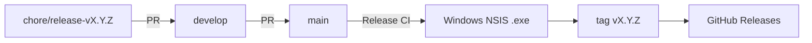

# リリース運用（TOP-33 確定版）

`docs/project-setup/repository-and-branch-strategy.md` と Issue TOP-33 の方針に基づく、現行のリリース手順です。

---

## 1. 確定した流れ

1. ユーザーが **MAJOR / MINOR / PATCH** を指定する
2. `create-release-pr` が `git fetch --tags` 後に次バージョンを **1 回**導出する
3. `chore/release-vX.Y.Z` ブランチでバージョンファイルを更新し、**develop 向け bump PR** を作成する（develop 直 push しない）
4. bump PR マージ後、同スキル（または手動）で **develop → main** のリリース PR を作成（本文に Version と一般向け変更サマリ）
5. リリース PR をマージすると **Release** ワークフローが起動し:
   - マージコミットを checkout し、PR 本文の Version と 3 マニフェストの一致を確認
   - Windows 上で NSIS インストーラ（`.exe`）をビルド
   - 成功後に `vX.Y.Z` タグを作成。**既存タグは HEAD と SHA 一致時のみスキップ**（不一致は失敗）
   - GitHub Releases を作成／更新し、`.exe` とサマリを添付

## 2. バージョニング

| 項目 | 内容 |
|------|------|
| 方式 | SemVer `MAJOR.MINOR.PATCH` |
| タグ | `v` プレフィックス（例: `v0.1.0`） |
| 同期先 | `package.json` / `src-tauri/tauri.conf.json` / `src-tauri/Cargo.toml` |
| 導出 | `.cursor/skills/create-release-pr/scripts/next-version.mjs`（タグ無し時のみ `0.0.0` 起点。git 失敗はエラー） |
| 書き込み | 同スクリプトの `--set X.Y.Z`（再導出せず固定版を書く） |

## 3. 成果物

| 項目 | 内容 |
|------|------|
| OS | Windows のみ（初版） |
| 形式 | Tauri NSIS インストーラ（`.exe`） |
| 配布 | GitHub Releases |
| 同梱ライセンス | `src-tauri/licenses/`（MIT + OFL 等。NSIS `licenseFile` 含む） |

## 4. 関連ファイル

| パス | 役割 |
|------|------|
| `.cursor/skills/create-release-pr/` | リリース / bump PR 作成スキル |
| `.github/workflows/release.yml` | マージ時のビルド・タグ・Release |
| `.github/workflows/ci.yml` | 通常の lint / test / build |
| `docs/project-setup/tauri-updater-feasibility.md` | 自動アップデート可否の調査 |

## 5. 初回リリース（例: v0.1.0）

タグが無い状態では `0.0.0` が起点。`MINOR` を選ぶと `0.1.0`（tag `v0.1.0`）。bump PR → develop マージ → develop→main PR → Actions 確認、の順。

## 6. 運用メモ

- develop を PR 必須に保護してよい（bump は chore ブランチ経由）
- リリース PR マージ後は main を develop へ同期し、次リリースの差分サマリが累積しないようにする（推奨）

## 変更履歴

| 日付 | 内容 |
|------|------|
| 2026-09-12 | TOP-33。develop→main PR + マージ時 CI を正式運用として記録。 |
| 2026-09-12 | bump を chore PR 経由に変更。ビルド後タグ・Version 一致確認・再実行耐性を追記。 |
