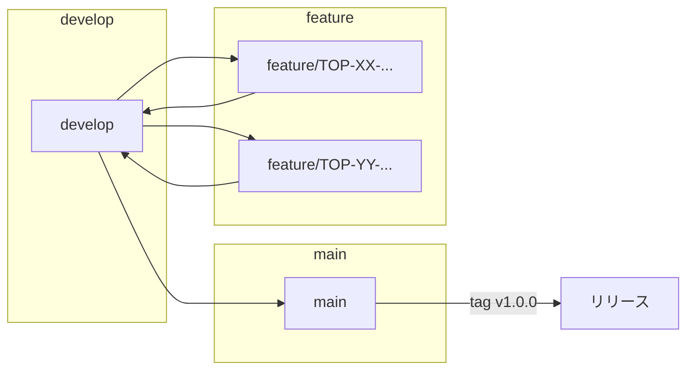

# リポジトリ構成・ブランチ戦略の方針決定（TOP-13）

Craft Post App プロジェクトのリポジトリ構成・ブランチ戦略・リリース方法を整理したドキュメントです。  
初期リポジトリ作成時および日々の開発・リリース時に参照してください。

---

## 1. リポジトリ形態（モノレポ / マルチレポ）

### 1.1 候補の比較

| 形態 | 概要 | メリット | デメリット |
|------|------|----------|------------|
| **モノレポ** | 1 リポジトリにアプリ本体・共通コード・スクリプトなどをまとめて管理する。 | 変更の一貫性が取りやすい。CI・リリースを 1 リポジトリで完結できる。個人〜小規模チーム向けに運用がシンプル。 | リポジトリが肥大化すると権限・履歴の分離が難しい（本プロジェクト規模では問題になりにくい）。 |
| **マルチレポ** | アプリ・共通ライブラリ・ツールなどを別リポジトリに分ける。 | 責務ごとにリポジトリを分離できる。 | 複数リポジトリのバージョン合わせ・リリース調整が煩雑。現時点の想定ユーザー数・チーム規模では過剰になりやすい。 |

### 1.2 採用方針

| 項目 | 決定内容 |
|------|----------|
| **採用形態** | **モノレポ** |
| **理由** | 想定は個人〜小規模チーム（TOP-6 要件・制約）。アプリ本体（Tauri + React）・ドキュメント・スクリプトを 1 リポジトリで管理し、履歴・タグ・リリースを一括で扱う方が運用しやすい。共通ライブラリが増えた場合も、まずは同一リポジトリ内のパッケージ／ディレクトリで対応する。 |

---

## 2. ディレクトリ構成

### 2.1 方針

- **アプリ本体**: Tauri の標準的なレイアウトに従う（`src-tauri` / フロント用ソースディレクトリ）。
- **ドキュメント**: 設計・決定事項は `docs/` に集約（既存の `requirements-and-constraints.md`、`decisions-summary.md` 等と同様）。
- **スクリプト**: ビルド補助・DB マイグレーション・開発用ユーティリティなどは `scripts/` に配置する想定。
- **共通ライブラリ**: 現時点ではアプリ内に含める。将来、Rust や TypeScript の共有モジュールが明確に分離した場合は `crates/` や `packages/` などを検討する。

### 2.2 想定ディレクトリ構成（ラフ）

```
（リポジトリルート）
├── docs/                    # 設計・要件・決定事項ドキュメント
│   ├── requirements-and-constraints.md
│   ├── decisions-summary.md
│   ├── architecture-overview.md
│   ├── repository-and-branch-strategy.md  # 本ドキュメント
│   └── （その他 各決定ドキュメント）
├── src-tauri/               # Tauri（Rust）バックエンド
│   ├── src/
│   ├── Cargo.toml
│   └── ...
├── src/                     # フロントエンド（React + TypeScript）
│   ├── components/
│   ├── pages/
│   ├── ...
│   └── （Tauri テンプレートに依存するため、初期作成時に確定）
├── scripts/                 # ビルド・マイグレーション・開発用スクリプト（任意）
├── .cursor/                 # Cursor 用設定（既存）
├── package.json
├── Cargo.toml               # ワークスペース用の場合
└── README.md
```

※ 実際の Tauri + React テンプレートでプロジェクトを生成した時点で、`src/` 以下の名前（例: `src` と `src-tauri` の並列、または `frontend/` など）はテンプレートに合わせて調整する。

### 2.3 補足

- **データ永続化**: SQLite ファイルはアプリ実行時に Tauri のアプリデータディレクトリに配置する方針（TOP-9）。リポジトリにはスキーマ定義・マイグレーション用スクリプトや SQL のみを置く想定。
- **設定ファイル**: 言語・フォーマッタ・リンターなどはルートまたは各レイヤに配置（例: `package.json`、`tsconfig.json`、`Cargo.toml`）。

---

## 3. ブランチ戦略

### 3.1 検討観点

- **main**: 本番相当の安定した状態を表すブランチ。
- **develop**: 統合開発用。feature からマージし、リリース可能な状態を保つ。
- **feature / fix ブランチ**: 機能追加・バグ修正用。Issue 番号やスラッグを付けて分岐し、develop にマージする。

### 3.2 採用方針

| 項目 | 決定内容 |
|------|----------|
| **基本モデル** | **Git Flow を簡略化した 3 ブランチ運用**（main / develop / feature）。 |
| **main** | 常にリリース可能な状態を保持する。タグは main に対して打つ（例: `v1.0.0`）。 |
| **develop** | 次リリースに向けた統合ブランチ。通常の開発は develop から feature を切る。 |
| **feature ブランチ** | 命名例: `feature/TOP-XX-短い説明` または `fix/TOP-XX-短い説明`。作業完了後、develop にマージ（Pull Request / Merge Request を推奨）。 |
| **リリース** | develop が安定した時点で main にマージし、タグでバージョン管理する。 |

### 3.3 運用の流れ（ラフ）



- **開発**: `develop` から `feature/TOP-13-...` のようにブランチを切り、作業後に develop へマージ。
- **リリース**: develop を main にマージし、main にタグ（例: `v1.0.0`）を打つ。必要に応じて develop へ main の変更を戻す（または main マージ後に develop を main と同期）。

### 3.4 補足

- **個人開発・小規模**: 上記を厳密に守らず、main と develop を同一にして「main + feature のみ」で運用することも可能。その場合は「main が常にリリース可能」というルールだけ維持する。
- **保護ルール**: main への直接 push 禁止、PR 必須などは、GitHub / GitLab のブランチ保護で設定することを推奨。

---

## 4. リリース方法

ブランチ戦略と合わせて、**何を・どのタイミングで・どう配布するか**を決めておく。個人〜小規模チーム向けに、シンプルで再現可能な運用を想定する。

### 4.1 バージョニング

| 項目 | 方針 |
|------|------|
| **方式** | **セマンティックバージョニング（SemVer）** `MAJOR.MINOR.PATCH`（例: `1.0.0`、`1.2.3`）。 |
| **タグ形式** | Git タグは `v` プレフィックス（例: `v1.0.0`）。main にマージしたうえでタグを打つ。 |
| **バージョンの置き場所** | `package.json` の `version` および Tauri の設定（`tauri.conf.json` 等）で 1 箇所または同期して管理する。ビルド成果物に同じバージョンが含まれるようにする。 |

- **MAJOR**: 互換性のない変更（API やデータ形式の破壊的変更など）。
- **MINOR**: 後方互換のある機能追加。
- **PATCH**: 後方互換のあるバグ修正など。

### 4.2 ビルド・成果物

| 項目 | 方針 |
|------|------|
| **ビルドコマンド** | Tauri の標準ビルド（例: `npm run tauri build` または `cargo tauri build`）。フロントのビルドと Rust のビルドが一括で実行される。 |
| **成果物** | OS ごとのインストーラまたは実行形式。Windows では `.msi` / `.exe`（インストーラ）、macOS では `.dmg` / `.app` など（Tauri の出力に従う）。 |
| **ビルド環境** | 各 OS 向けバイナリは原則その OS 上でビルドする（クロスコンパイルは Tauri では一般的でない）。CI で複数 OS を扱う場合は GitHub Actions のマルチOS ワークフローなどを検討する。 |

※ 詳細（ビルド手順・成果物の格納先）はプロジェクト初期化後に `README.md` や `scripts/` で整える。

### 4.3 配布・公開

| 項目 | 方針 |
|------|------|
| **配布の起点** | **GitHub Releases**（または GitLab Releases）を想定。タグ（例: `v1.0.0`）に紐づけてリリースノートとビルド成果物を添付する。 |
| **公開範囲** | 個人〜小規模利用を想定するため、現時点では「リポジトリが参照できる人向け」の公開で十分な場合が多い。必要に応じて公開リポジトリ化やダウンロード用 URL の共有で対応する。 |
| **リリースノート** | タグごとに「変更内容の要約」「主な修正・機能」を記載する。変更履歴は CHANGELOG や Linear の完了 Issue からまとめてもよい。 |

### 4.4 アップデート（任意）

| 項目 | 方針 |
|------|------|
| **Tauri Updater** | 要件では「アップデートの取得は必要最小限」（要件・制約）とある。Tauri の **Updater** を有効にすると、アプリ内から新バージョンの検知・ダウンロードが可能。導入する場合は Tauri の updater 設定とサーバ側の更新情報（JSON）の配置が必要。 |
| **署名** | Updater 用の署名は Tauri の仕組みで無料で利用可能。OS レベル（Windows の Authenticode 等）の署名は有料のため、必要に応じて別途検討（desktop-tech-comparison-and-decision.md を参照）。 |
| **今回の範囲** | 初版リリースでは「手動で新しいビルドをダウンロードして入れ替え」でも可。Updater は後から追加可能。 |

### 4.5 リリースの流れ（ラフ）

1. **develop** でリリース対象の変更を揃え、動作確認する。
2. **main** にマージする（PR 推奨）。
3. **main** にタグを打つ（例: `git tag v1.0.0` → push）。
4. 該当タグで **ビルド** を実行し、成果物（インストーラ等）を取得する。
5. **GitHub Releases** で該当タグのリリースを作成し、成果物をアップロード・リリースノートを記載する。
6. （運用次第）develop を main と同期する。

※ CI で「タグ push 時にビルドして Release に成果物を添付」まで自動化すると、手順 4・5 が簡略化できる。初期は手動でもよい。

---

## 5. まとめ（初期リポジトリ作成時のチェックリスト）

| 観点 | 方針 |
|------|------|
| **リポジトリ形態** | モノレポ（1 リポジトリにアプリ・docs・scripts を集約）。 |
| **ディレクトリ** | `docs/`（設計ドキュメント）、`src-tauri/`（Rust）、フロント用ソース（Tauri テンプレート準拠）、`scripts/`（任意）。 |
| **ブランチ** | main（リリース用） / develop（統合用） / feature（作業用）。feature は develop から分岐し、develop にマージ。 |
| **タグ** | リリース時は main にバージョンタグ（例: `v1.0.0`）を打つ。 |
| **バージョニング** | SemVer（MAJOR.MINOR.PATCH）。タグは `v1.0.0` 形式。 |
| **ビルド** | Tauri 標準ビルドで OS 別インストーラ・実行形式を生成。 |
| **配布** | GitHub Releases（または GitLab Releases）でタグに成果物とリリースノートを添付。 |
| **アップデート** | 初版は手動配布で可。Tauri Updater は必要に応じて後から導入。 |

---

## 変更履歴・メモ

| 日付       | 内容 |
|------------|------|
| 2026-03-08 | 初版。TOP-13「リポジトリ構成・ブランチ戦略の方針決定」に基づき作成。モノレポ・ディレクトリ構成・ブランチ戦略を整理した。 |
| 2026-03-08 | 4. リリース方法を追加。バージョニング（SemVer）・ビルド・配布（GitHub Releases）・アップデート方針・リリースの流れを記載。5. まとめにリリース関連項目を追加。 |
